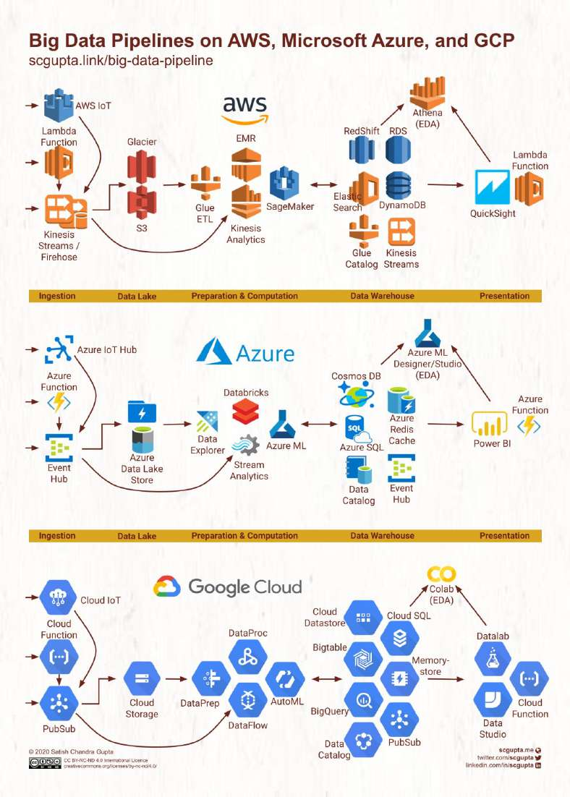

# Which cloud provider should be used when building a big data solution?

> **Source**: ByteByteGo — System Design compilation PDF

big data solution?
The diagram below illustrates the detailed comparison of AWS, Google
Cloud, and Microsoft Azure.

The common parts of the solutions:
1. Data ingestion of structured or unstructured data.
2. Raw data storage.
3. Data processing, including filtering, transformation, normalization,
etc.
4. Data warehouse, including key-value storage, relational database,
OLAP database, etc.
5. Presentation layer with dashboards and real-time notifications.
It is interesting to see different cloud vendors have different names for
the same type of products.
For example, the first step and the last step both use the serverless
product. The product is called “lambda” in AWS, and “function” in
Azure and Google Cloud.
Question - which products have you used in production? What kind of
application did you use it for?
Source: S.C. Gupta’s post

