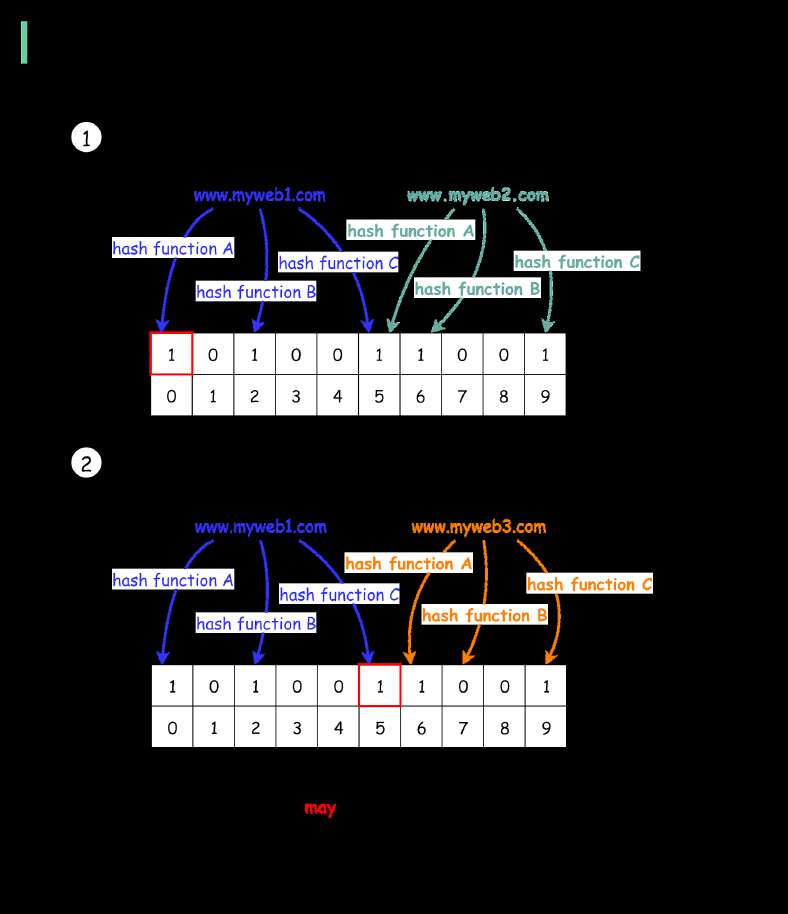

# How to avoid crawling duplicate URLs at Google scale?

> **Source**: ByteByteGo — System Design compilation PDF

Option 1: Use a Set data structure to check if a URL already exists or
not. Set is fast, but it is not space-efficient.
Option 2: Store URLs in a database and check if a new URL is in the
database. This can work but the load to the database will be very high.
Option 3: 𝐁𝐥𝐨𝐨𝐦 𝐟𝐢𝐥𝐭𝐞𝐫. This option is preferred. Bloom filter was
proposed by Burton Howard Bloom in 1970. It is a probabilistic data
structure that is used to test whether an element is a member of a set.
🔹false: the element is definitely not in the set.
🔹true: the element is probably in the set.
False-positive matches are possible, but false negatives are not.
The diagram below illustrates how the Bloom filter works. The basic
data structure for the Bloom filter is Bit Vector. Each bit represents a
hashed value.

Step 1: To add an element to the bloom filter, we feed it to 3 different
hash functions (A, B, and C) and set the bits at the resulting positions.
Note that both “www.myweb1.com” and “www.myweb2.com” mark the
same bit with 1 at index 5. False positives are possible because a bit
might be set by another element.
Step 2: When testing the existence of a URL string, the same hash
functions A, B, and C are applied to the URL string. If all three bits are

1, then the URL may exist in the dataset; if any of the bits is 0, then the
URL definitely does not exist in the dataset.
Hash function choices are important. They must be uniformly
distributed and fast. For example, RedisBloom and Apache Spark use
murmur, and InfluxDB uses xxhash.
Question - In our example, we used three hash functions. How many
hash functions should we use in reality? What are the trade-offs?
—
Check out our bestselling system design books.
Paperback: Amazon Digital: ByteByteGo.

