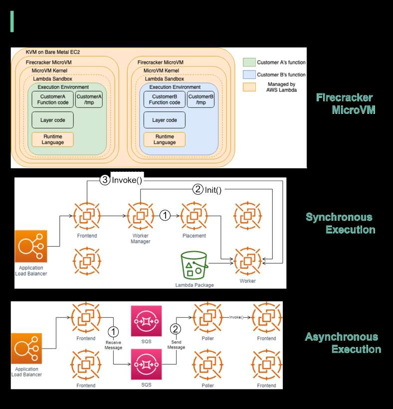

# AWS Lambda behind the scenes

> **Source**: ByteByteGo — System Design compilation PDF

Serverless is one of the hottest topics in cloud services. How does
AWS Lambda work behind the scenes?
Lambda is a 𝐬𝐞𝐫𝐯𝐞𝐫𝐥𝐞𝐬𝐬 computing service provided by Amazon Web
Services (AWS), which runs functions in response to events.
𝐅𝐢𝐫𝐞𝐜𝐫𝐚𝐜𝐤𝐞𝐫 𝐌𝐢𝐜𝐫𝐨𝐕𝐌
Firecracker is the engine powering all of the Lambda functions [1]. It is
a virtualization technology developed at Amazon and written in Rust.
The diagram below illustrates the isolation model for AWS Lambda
Workers.

Lambda functions run within a sandbox, which provides a minimal
Linux userland, some common libraries and utilities. It creates the
Execution environment (worker) on EC2 instances.
How are lambdas initiated and invoked? There are two ways.
𝐒𝐲𝐧𝐜𝐡𝐫𝐨𝐧𝐨𝐮𝐬 𝐞𝐱𝐞𝐜𝐮𝐭𝐢𝐨𝐧
Step1: "The Worker Manager communicates with a Placement Service
which is responsible to place a workload on a location for the given
host (it’s provisioning the sandbox) and returns that to the Worker
Manager" [2].
Step 2: "The Worker Manager can then call 𝘐𝘯𝘪𝘵 to initialize the function
for execution by downloading the Lambda package from S3 and
setting up the Lambda runtime" [2]
Step 3: The Frontend Worker is now able to call 𝘐𝘯𝘷𝘰𝘬𝘦 [2].
𝐀𝐬𝐲𝐧𝐜𝐡𝐫𝐨𝐧𝐨𝐮𝐬 𝐞𝐱𝐞𝐜𝐮𝐭𝐢𝐨𝐧
Step 1: The Application Load Balancer forwards the invocation to an
available Frontend which places the event onto an internal
queue(SQS).
Step 2:  There is "a set of pollers assigned to this internal queue which
are responsible for polling it and moving the event onto a Frontend
synchronously. After it’s been placed onto the Frontend it follows the
synchronous invocation call pattern which we covered earlier" [2].
Question: Can you think of any use cases for AWS Lambda?
Sources:
[1] AWS Lambda whitepaper:
https://docs.aws.amazon.com/whitepapers/latest/security-overview-aw
s-lambda/lambda-executions.html
[2] Behind the scenes, Lambda:
https://www.bschaatsbergen.com/behind-the-scenes-lambda/
Image source: [1] [2]

