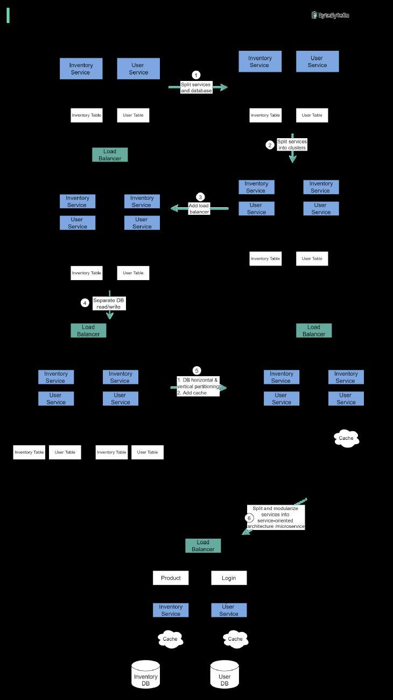

# How to scale a website to support millions of users?

> **Source**: ByteByteGo — System Design compilation PDF

We will explain this step-by-step. The diagram below illustrates the evolution of a simplified eCommerce website. It goes from a monolithic design on one single server, to a service-oriented/microservice architecture.

Suppose we have two services: inventory service (handles product descriptions and inventory management) and user service (handles user information, registration, login, etc.). Step 1 - With the growth of the user base, one single application server cannot handle the traffic anymore. We put the application server and the database server into two separate servers. Step 2 - The business continues to grow, and a single application server is no longer enough. So we deploy a cluster of application servers. Step 3 - Now the incoming requests have to be routed to multiple application servers, how can we ensure each application server gets an even load? The load balancer handles this nicely. Step 4 - With the business continuing to grow, the database might become the bottleneck. To mitigate this, we separate reads and writes in a way that frequent read queries go to read replicas. With this setup, the throughput for the database writes can be greatly increased. Step 5 - Suppose the business continues to grow. One single database cannot handle the load on both the inventory table and user table. We have a few options: 1. Vertical partition. Adding more power (CPU, RAM, etc.) to the database server. It has a hard limit. 2. Horizontal partition by adding more database servers. 3. Adding a caching layer to offload read requests. Step 6 - Now we can modularize the functions into different services. The architecture becomes service-oriented / microservice. Question: what else do we need to support an e-commerce website at Amazon’s scale?
