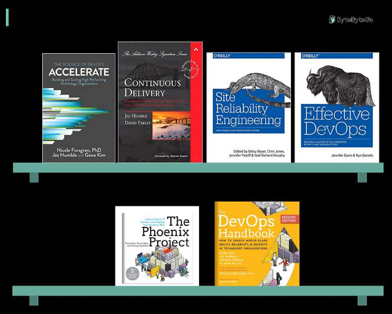

# DevOps Books

> **Source**: ByteByteGo — System Design compilation PDF

Some **DevOps** books I find enlightening: - Accelerate - presents both the findings and the science behind measuring software delivery performance. - Continuous Delivery - introduces automated architecture management and data migration. It also pointed out key problems and optimal solutions in each area. - Site Reliability Engineering - famous Google SRE book. It explains the whole life cycle of Google’s development, deployment, and monitoring, and how to manage the world’s biggest software systems. - Effective DevOps - provides effective ways to improve team coordination.

- The Phoenix Project - a classic novel about effectiveness and communications. IT work is like manufacturing plant work, and a system must be established to streamline the workflow. Very interesting read! - The DevOps Handbook - introduces product development, quality assurance, IT operations, and information security. What’s your favorite dev-ops book?
