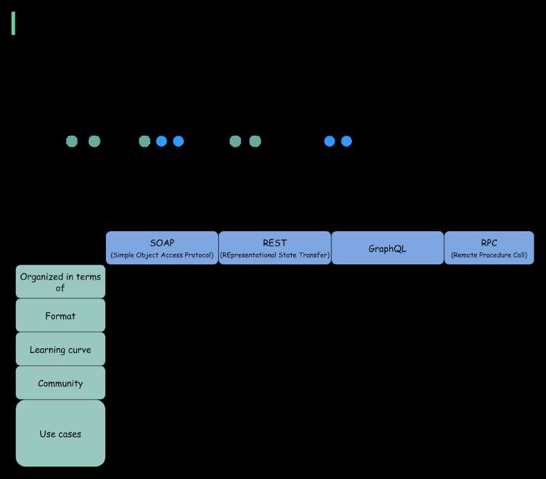

# SOAP vs REST vs GraphQL vs RPC.

> **Source**: ByteByteGo — System Design compilation PDF

The diagram below illustrates the API timeline and API styles
comparison.
Over time, different API architectural styles are released. Each of them
has its own patterns of standardizing data exchange.
You can check out the use cases of each style in the diagram.
Source: https://lnkd.in/gFgi33RY I combined a few diagrams together.
The credit all goes to AltexSoft.
—
Check out our bestselling system design books.
Paperback: Amazon Digital: ByteByteGo.

