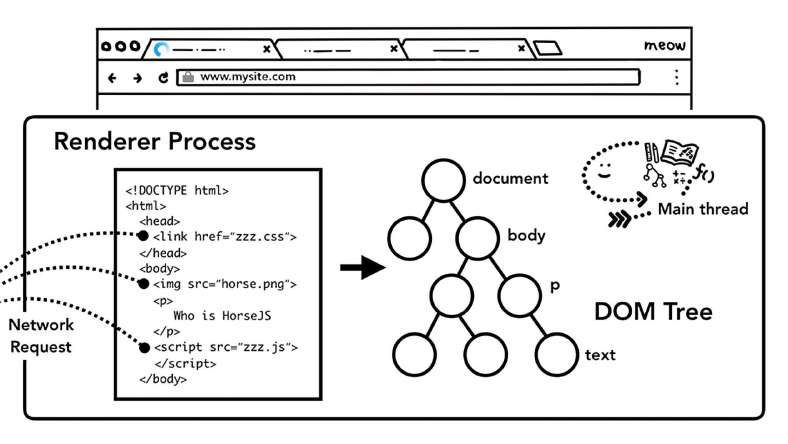

# How do modern browsers work?

> **Source**: ByteByteGo — System Design compilation PDF

Google published a series of articles about "Inside look at modern web browser". It's a great read. Links: https://developer.chrome.com/blog/inside-browser-part1/ https://developer.chrome.com/blog/inside-browser-part2/ https://developer.chrome.com/blog/inside-browser-part3/ https://developer.chrome.com/blog/inside-browser-part4/
