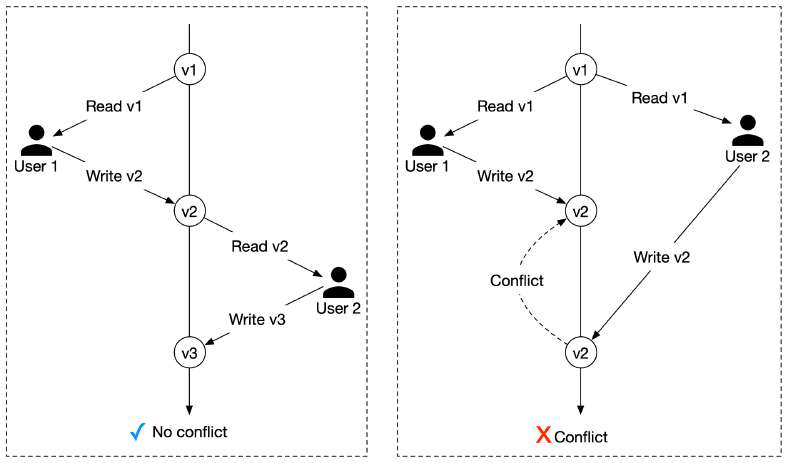

# Optimistic locking

> **Source**: ByteByteGo — System Design compilation PDF

Optimistic locking, also referred to as optimistic concurrency control,
allows multiple concurrent users to attempt to update the same
resource.
There are two common ways to implement optimistic locking: version
number and timestamp. Version number is generally considered to be
a better option because the server clock can be inaccurate over time.
We explain how optimistic locking works with version number.
The diagram below shows a successful case and a failure case.
1. A new column called “version” is added to the database table.
2. Before a user modifies a database row, the application reads the
version number of the row.
3. When the user updates the row, the application increases the
version number by 1 and writes it back to the database.
4. A database validation check is put in place; the next version number
should exceed the current version number by 1. The transaction aborts
if the validation fails and the user tries again from step 2.

Optimistic locking is usually faster than pessimistic locking because we
do not lock the database. However, the performance of optimistic
locking drops dramatically when concurrency is high.
To understand why, consider the case when many clients try to reserve
a hotel room at the same time. Because there is no limit on how many
clients can read the available room count, all of them read back the
same available room count and the current version number. When
different clients make reservations and write back the results to the
database, only one of them will succeed, and the rest of the clients
receive a version check failure message. These clients have to retry. In
the subsequent round of retries, there is only one successful client
again, and the rest have to retry. Although the end result is correct,
repeated retries cause a very unpleasant user experience.
Question: what are the possible ways of solving race conditions?

