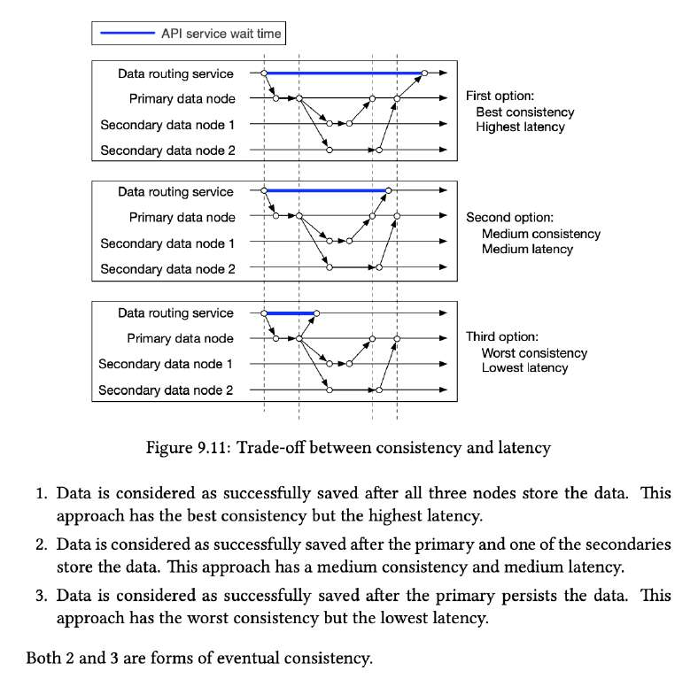

# Tradeoff between latency and consistency

> **Source**: ByteByteGo — System Design compilation PDF

Understanding the **tradeoffs** is very important not only in system design interviews but also designing real-world systems. When we talk about data replication, there is a fundamental tradeoff between **latency** and **consistency**. It is illustrated by the diagram below.
