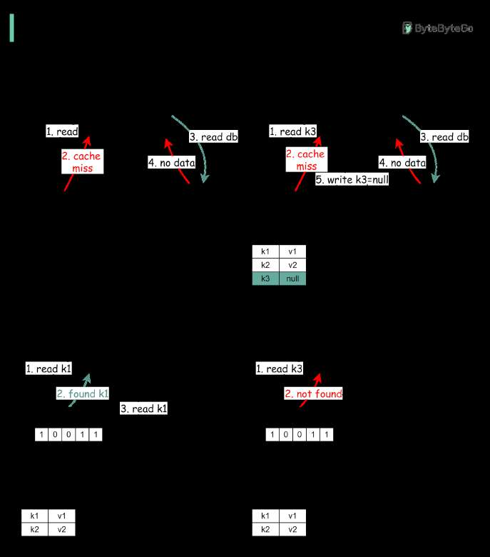

# Cache miss attack

> **Source**: ByteByteGo — System Design compilation PDF

Caching is awesome but it doesn’t come without a cost, just like many things in life. One of the issues is

**Cache Miss Attack**

Correct me if this is not the right term. It refers to the scenario where data to fetch doesn't exist in the database and the data isn’t cached either. So every request hits the database eventually, defeating the purpose of using a cache. If a malicious user initiates lots of queries with such keys, the database can easily be overloaded. The diagram below illustrates the process. Two approaches are commonly used to solve this problem:

- Cache keys with null value. Set a short TTL (Time to Live) for keys with null value. - Using Bloom filter. A Bloom filter is a data structure that can rapidly tell us whether an element is present in a set or not. If the key exists, the request first goes to the cache and then queries the database if needed. If the key doesn't exist in the data set, it means the key doesn’t exist in the cache/database. In this case, the query will not hit the cache or database layer.
—
Check out our bestselling system design books. Paperback: Amazon Digital: ByteByteGo.
