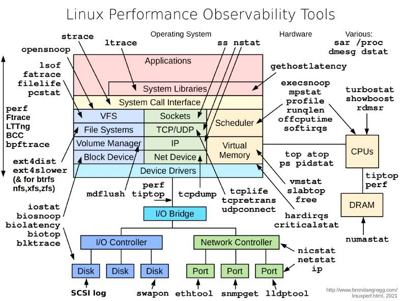

# How to diagnose a mysterious process that’s taking too much CPU, memory, IO, etc?

> **Source**: ByteByteGo — System Design compilation PDF

much CPU, memory, IO, etc? The diagram below illustrates helpful tools in a Linux system. - ‘vmstat’ - reports information about processes, memory, paging, block IO, traps, and CPU activity. - ‘iostat’ - reports CPU and input/output statistics of the system. - ‘netstat’ - displays statistical data related to IP, TCP, UDP, and ICMP protocols. - ‘lsof’ - lists open files of the current system. - ‘pidstat’ - monitors the utilization of system resources by all or specified processes, including CPU, memory, device IO, task switching, threads, etc.
