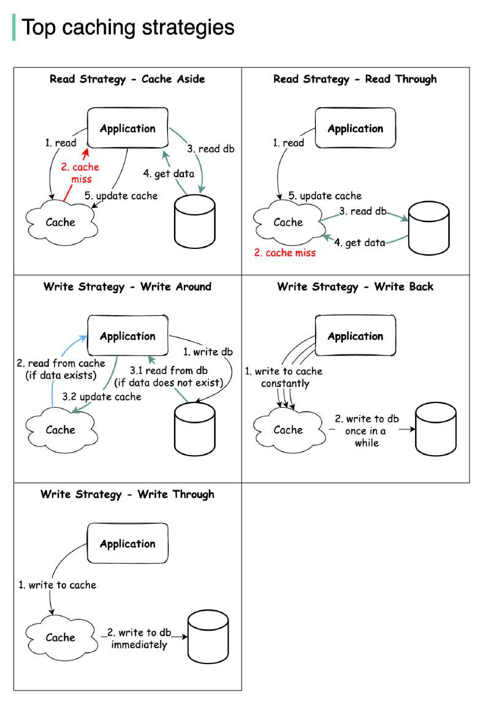

# What are the top cache strategies?

> **Source**: ByteByteGo — System Design compilation PDF

Read data from the system: - Cache aside - Read through Write data to the system: - Write around - Write back - Write through The diagram below illustrates how those 5 strategies work. Some of the caching strategies can be used together.

I left out a lot of details as that will make the post very long. Feel free to leave a comment so we can learn from each other.

Question: What are the pros and cons of each caching strategy? How to choose the right one to use?
—
Check out our bestselling system design books. Paperback: Amazon Digital: ByteByteGo.
