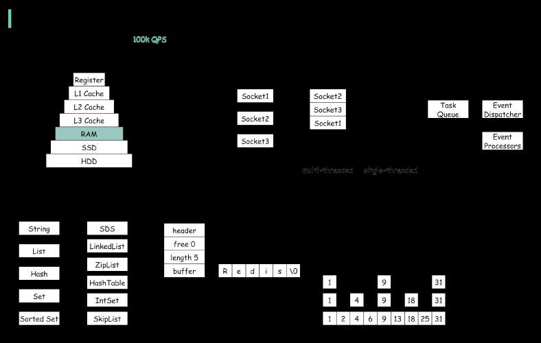

# Why is Redis so Fast?

> **Source**: ByteByteGo — System Design compilation PDF

There are 3 main reasons as shown in the diagram below. 1. Redis is a RAM-based database. RAM access is at least 1000 times faster than random disk access. 2. Redis leverages IO multiplexing and single-threaded execution loop for execution efficiency. 3. Redis leverages several efficient lower-level data structures. Question: Another popular in-memory store is Memcached. Do you know the differences between Redis and Memcached? You might have noticed the style of this diagram is different from my previous posts. Please let me know which one you prefer.
—
Check out our bestselling system design books. Paperback: Amazon Digital: ByteByteGo.
