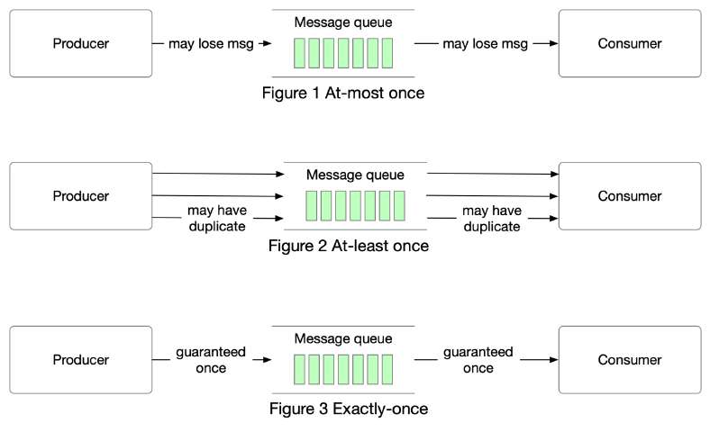

# At-most once, at-least once, and exactly once

> **Source**: ByteByteGo — System Design compilation PDF

In modern architecture, systems are broken up into small and
independent building blocks with well-defined interfaces between them.
Message queues provide communication and coordination for those
building blocks. Today, let’s discuss different delivery semantics:
at-most once, at-least once, and exactly once.
𝐀𝐭-𝐦𝐨𝐬𝐭 𝐨𝐧𝐜𝐞
As the name suggests, at-most once means a message will be
delivered not more than once. Messages may be lost but are not
redelivered. This is how at-most once delivery works at the high level.
Use cases: It is suitable for use cases like monitoring metrics, where a
small amount of data loss is acceptable.
𝐀𝐭-𝐥𝐞𝐚𝐬𝐭 𝐨𝐧𝐜𝐞
With this data delivery semantic, it’s acceptable to deliver a message
more than once, but no message should be lost.
Use cases: With at-least once, messages won’t be lost but the same
message might be delivered multiple times. While not ideal from a user
perspective, at-least once delivery semantics are usually good enough
for use cases where data duplication is not a big issue or deduplication

is possible on the consumer side. For example, with a unique key in
each message, a message can be rejected when writing duplicate data
to the database.
𝐄𝐱𝐚𝐜𝐭𝐥𝐲 𝐨𝐧𝐜𝐞
Exactly once is the most difficult delivery semantic to implement. It is
friendly to users, but it has a high cost for the system’s performance
and complexity.
Use cases: Financial-related use cases (payment, trading, accounting,
etc.). Exactly once is especially important when duplication is not
acceptable and the downstream service or third party doesn’t support
idempotency.
Question: what is the difference between message queues vs event
streaming platforms such as Kafka, Apache Pulsar, etc?

