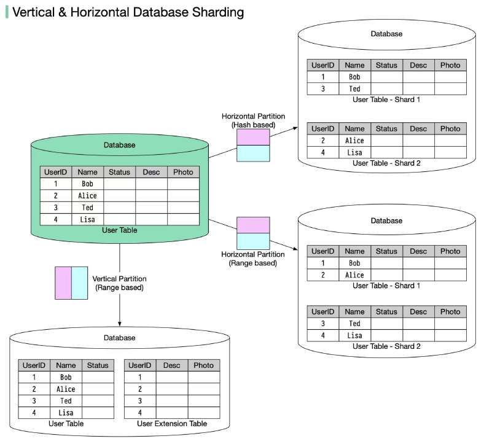

# Vertical partitioning and Horizontal partitioning

> **Source**: ByteByteGo — System Design compilation PDF

In many large-scale applications, data is divided into partitions that can
be accessed separately. There are two typical strategies for partitioning
data.
🔹 Vertical partitioning: it means some columns are moved to new
tables. Each table contains the same number of rows but fewer
columns (see diagram below).
🔹 Horizontal partitioning (often called sharding): it divides a table into
multiple smaller tables. Each table is a separate data store, and it
contains the same number of columns, but fewer rows (see diagram
below).

Horizontal partitioning is widely used so let’s take a closer look.
𝐑𝐨𝐮𝐭𝐢𝐧𝐠 𝐚𝐥𝐠𝐨𝐫𝐢𝐭𝐡𝐦
Routing algorithm decides which partition (shard) stores the data.
🔹 Range-based sharding. This algorithm uses ordered columns, such
as integers, longs, timestamps, to separate the rows. For example, the
diagram below uses the User ID column for range partition: User IDs 1
and 2 are in shard 1, User IDs 3 and 4 are in shard 2.
🔹 Hash-based sharding. This algorithm applies a hash function to one
column or several columns to decide which row goes to which table.
For example, the diagram below uses 𝐔𝐬𝐞𝐫 𝐈𝐃 𝐦𝐨𝐝 2 as a hash
function. User IDs 1 and 3 are in shard 1, User IDs 2 and 4 are in
shard 2.
𝐁𝐞𝐧𝐞𝐟𝐢𝐭𝐬
🔹 Facilitate horizontal scaling. Sharding facilitates the possibility of
adding more machines to spread out the load.
🔹 Shorten response time. By sharding one table into multiple tables,
queries go over fewer rows, and results are returned much more
quickly.
𝐃𝐫𝐚𝐰𝐛𝐚𝐜𝐤𝐬
🔹 The order by the operation is more complicated. Usually, we need
to fetch data from different shards and sort the data in the application's
code.
🔹 Uneven distribution. Some shards may contain more data than
others (this is also called the hotspot).
This topic is very big and I’m sure I missed a lot of important details.
What else do you think is important for data partitioning?

