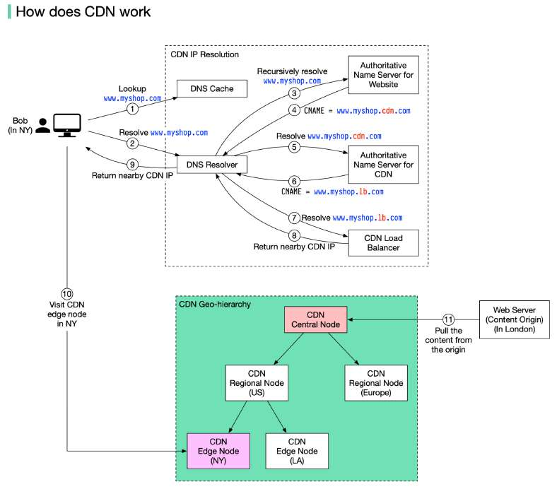

# CDN

> **Source**: ByteByteGo — System Design compilation PDF

A content delivery network (CDN) refers to a geographically distributed servers (also called edge servers) which provide fast delivery of static and dynamic content. Let’s take a look at how it works. Suppose Bob who lives in New York wants to visit an eCommerce website that is deployed in London. If the request goes to servers located in London, the response will be quite slow. So we deploy CDN servers close to where Bob lives, and the content will be loaded from the nearby CDN server. The diagram below illustrates the process: 1. Bob types in www.myshop.com in the browser. The browser looks up the domain name in the local DNS cache.

2. If the domain name does not exist in the local DNS cache, the browser goes to the DNS resolver to resolve the name. The DNS resolver usually sits in the Internet Service Provider (ISP). 3. The DNS resolver recursively resolves the domain name (see my previous post for details). Finally, it asks the authoritative name server to resolve the domain name. 4. If we don’t use CDN, the authoritative name server returns the IP address for www.myshop.com. But with CDN, the authoritative name server has an alias pointing to www.myshop.cdn.com (the domain name of the CDN server). 5. The DNS resolver asks the authoritative name server to resolve www.myshop.cdn.com. 6. The authoritative name server returns the domain name for the load balancer of CDN www.myshop.lb.com. 7. The DNS resolver asks the CDN load balancer to resolve www.myshop.lb.com. The load balancer chooses an optimal CDN edge server based on the user’s IP address, user’s ISP, the content requested, and the server load. 8. The CDN load balancer returns the CDN edge server’s IP address for www.myshop.lb.com. 9. Now we finally get the actual IP address to visit. The DNS resolver returns the IP address to the browser. 10. The browser visits the CDN edge server to load the content. There are two types of contents cached on the CDN servers: static contents and dynamic contents. The former contains static pages, pictures, and videos; the latter one includes results of edge computing. 11. If the edge CDN server cache doesn't contain the content, it goes upward to the regional CDN server. If the content is still not found, it will go upward to the central CDN server, or even go to the origin - the

London web server. This is called the CDN distribution network, where the servers are deployed geographically. Over to you: How do you prevent videos cached on CDN from being pirated?
