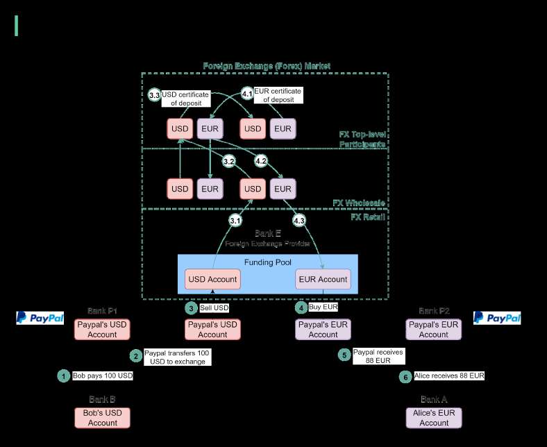
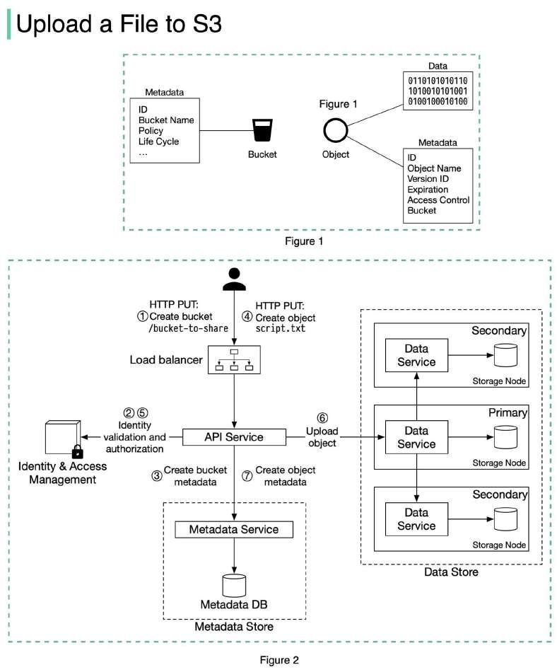

# Foreign exchange in payment

> **Source**: ByteByteGo — System Design compilation PDF

Have you wondered what happens under the hood when you pay with USD online and the seller from Europe receives EUR (euro)? This process is called foreign exchange. Suppose Bob (the buyer) needs to pay 100 USD to Alice (the seller), and Alice can only receive EUR. The diagram below illustrates the process. 1. Bob sends 100 USD via a third-party payment provider. In our example, it is Paypal. The money is transferred from Bob’s bank account (Bank B) to Paypal’s account in Bank P1. 2. Paypal needs to convert USD to EUR. It leverages the foreign exchange provider (Bank E). Paypal sends 100 USD to its USD account in Bank E.

3. 100 USD is sold to Bank E’s funding pool. 4. Bank E’s funding pool provides 88 EUR in exchange for 100 USD. The money is put into Paypal’s EUR account in Bank E. 5. Paypal’s EUR account in Bank P2 receives 88 EUR. 6. 88 EUR is paid to Alice’s EUR account in Bank A. Now let’s take a close look at the foreign exchange (forex) market. It has 3 layers: - Retail market. Funding pools are parts of the retail market. To improve efficiency, Paypal usually buys a certain amount of foreign currencies in advance. - Wholesale market. The wholesale business is composed of investment banks, commercial banks, and foreign exchange providers. It usually handles accumulated orders from the retail market. - Top-level participants. They are multinational commercial banks that hold a large number of certificates of deposit from different countries. They exchange these certificates for foreign exchange trading. When Bank E’s funding pool needs more EUR, it goes upward to the wholesale market to sell USD and buy EUR. When the wholesale market accumulates enough orders, it goes upward to top-level participants. Steps 3.1-3.3 and 4.1-4.3 explain how it works. If you have any questions, please leave a comment. What foreign currency did you find difficult to exchange? And what company have you used for foreign currency exchange?

Interview Question: Design S3 What happens when you upload a file to Amazon S3? Let’s design an S3 like object storage system. Before we dive into the design, let’s define some terms.

**Bucket**. A logical container for objects. The bucket name is globally unique. To upload data to S3, we must first create a bucket. **Object**. An object is an individual piece of data we store in a bucket. It contains object data (also called payload) and metadata. Object data can be any sequence of bytes we want to store. The metadata is a set of name-value pairs that describe the object. An S3 object consists of (Figure 1): - Metadata. It is mutable and contains attributes such as ID, bucket name, object name, etc. - Object data. It is immutable and contains the actual data. In S3, an object resides in a bucket. The path looks like this: /bucket-to-share/script.txt. The bucket only has metadata. The object has metadata and the actual data. The diagram below (Figure 2) illustrates how file uploading works. In this example, we first create a bucket named “bucket-to-share” and then upload a file named “script.txt” to the bucket. 1. The client sends an HTTP PUT request to create a bucket named “bucket-to-share.” The request is forwarded to the API service. 2. The API service calls the Identity and Access Management (IAM) to ensure the user is authorized and has WRITE permission. 3. The API service calls the metadata store to create an entry with the bucket info in the metadata database. Once the entry is created, a success message is returned to the client. 4. After the bucket is created, the client sends an HTTP PUT request to create an object named “script.txt”. 5. The API service verifies the user’s identity and ensures the user has WRITE permission on the bucket.

6. Once validation succeeds, the API service sends the object data in the HTTP PUT payload to the data store. The data store persists the payload as an object and returns the UUID of the object. 7. The API service calls the metadata store to create a new entry in the metadata database. It contains important metadata such as the object_id (UUID), bucket_id (which bucket the object belongs to), object_name, etc.
