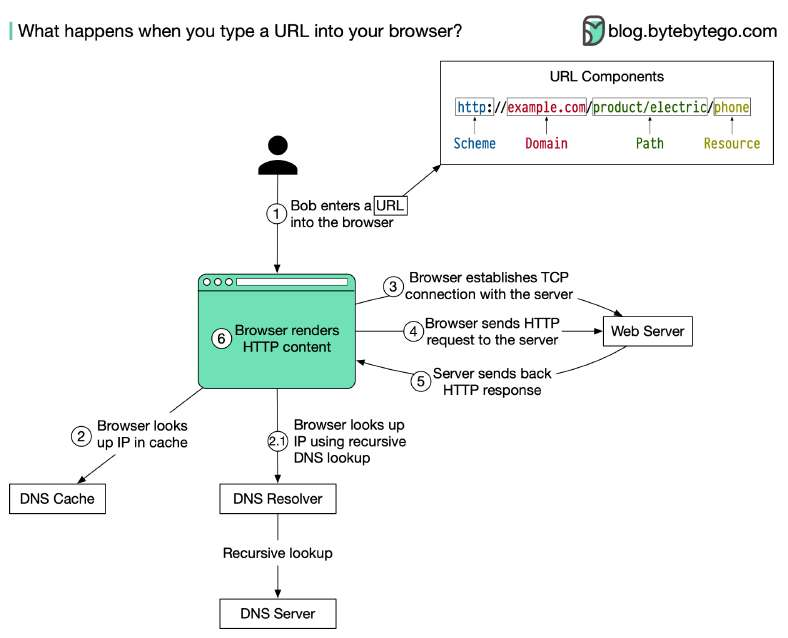

# What happens when you type a URL into your browser?

> **Source**: ByteByteGo — System Design compilation PDF

The diagram below illustrates the steps. 1. Bob enters a URL into the browser and hits Enter. In this example, the URL is composed of 4 parts: - scheme - **https**://. This tells the browser to send a connection to the server using HTTPS. - domain - **example**.**com**. This is the domain name of the site. - path - **product/electric**. It is the path on the server to the requested resource: phone. - resource - **phone**. It is the name of the resource Bob wants to visit. 2. The browser looks up the IP address for the domain with a domain name system (DNS) lookup. To make the lookup process fast, data is cached at different layers: browser cache, OS cache, local network cache and ISP cache.

2.1 If the IP address cannot be found at any of the caches, the browser goes to DNS servers to do a recursive DNS lookup until the IP address is found (this will be covered in another post). 3. Now that we have the IP address of the server, the browser establishes a TCP connection with the server. 4. The browser sends a HTTP request to the server. The request looks like this: **𝘎𝘌𝘛 /𝘱𝘩𝘰𝘯𝘦 𝘏𝘛𝘛𝘗**/1.1 **𝘏𝘰𝘴𝘵**: **𝘦𝘹𝘢𝘮𝘱𝘭𝘦**.**𝘤𝘰𝘮** 5. The server processes the request and sends back the response. For a successful response (the status code is 200). The HTML response might look like this: **𝘏𝘛𝘛𝘗**/1.1 200 **𝘖𝘒 𝘋𝘢𝘵𝘦**: **𝘚𝘶𝘯**, 30 **𝘑𝘢𝘯** 2022 00:01:01 **𝘎𝘔𝘛 𝘚𝘦𝘳𝘷𝘦𝘳**: **𝘈𝘱𝘢𝘤𝘩𝘦 𝘊𝘰𝘯𝘵𝘦𝘯𝘵-𝘛𝘺𝘱𝘦**: **𝘵𝘦𝘹𝘵/𝘩𝘵𝘮𝘭**; **𝘤𝘩𝘢𝘳𝘴𝘦𝘵**=**𝘶𝘵𝘧**-8 <!**𝘋𝘖𝘊𝘛𝘠𝘗𝘌 𝘩𝘵𝘮𝘭**> <**𝘩𝘵𝘮𝘭 𝘭𝘢𝘯𝘨**="**𝘦𝘯**"> **𝘏𝘦𝘭𝘭𝘰 𝘸𝘰𝘳𝘭𝘥** </**𝘩𝘵𝘮𝘭**> 6. The browser renders the HTML content.
