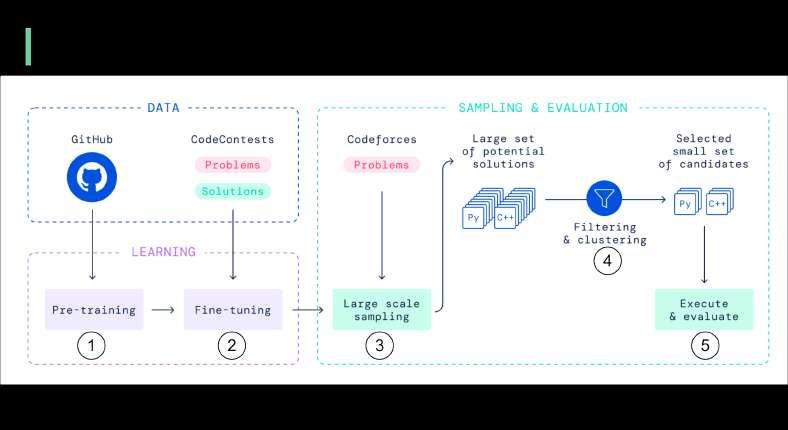

# AI Coding engine

> **Source**: ByteByteGo — System Design compilation PDF

DeepMind says its new AI coding engine (AlphaCode) is as good as an average programmer. The AI bot participated in the 10 Codeforces coding competitions and was ranked 54.3%. It means its score exceeded half of the human contestants. If we look at its score for the last 6 months, AlphaCode ranks at 28%. The diagram below explains how the AI bot works: 1. Pre-train the transformer models on GitHub code. 2. Fine-tune the models on the relatively small competitive programming dataset. 3. At evaluation time, create a massive amount of solutions for each problem. 4. Filter, cluster and rerank the solutions to a small set of candidate programs (at most 10), and then submit for further assessments. 5. Run the candidate programs against the test cases, evaluate the performance, and choose the best one.

Do you think AI bot will be better at Leetcode or competitive programming than software engineers five years from now?
