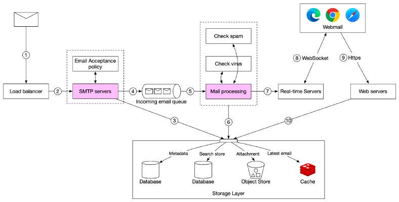

# Email receiving flow

> **Source**: ByteByteGo — System Design compilation PDF

The following diagram demonstrates the email receiving flow.
1. Incoming emails arrive at the SMTP load balancer.
2. The load balancer distributes traffic among SMTP servers. Email
acceptance policy can be configured and applied at the
SMTP-connection level. For example, invalid emails are bounced to
avoid unnecessary email processing.
3. If the attachment of an email is too large to put into the queue, we
can put it into the attachment store (s3).
4. Emails are put in the incoming email queue. The queue decouples
mail processing workers from SMTP servers so they can be scaled
independently. Moreover, the queue serves as a buffer in case the
email volume surges.
5. Mail processing workers are responsible for a lot of tasks, including
filtering out spam mails, stopping viruses, etc. The following steps
assume an email passed the validation.
6. The email is stored in the mail storage, cache, and object data store.

7. If the receiver is currently online, the email is pushed to real-time
servers.
8. Real-time servers are WebSocket servers that allow clients to
receive new emails in real-time.
9. For offline users, emails are stored in the storage layer. When a user
comes back online, the webmail client connects to web servers via
RESTful API.
10. Web servers pull new emails from the storage layer and return
them to the client.

