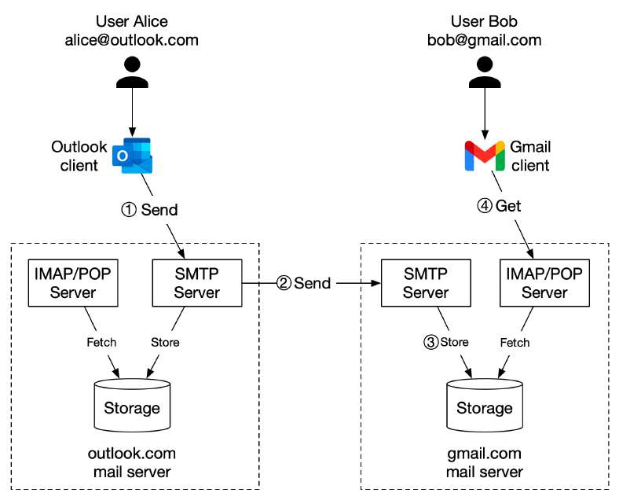

# Interview Question: Design Gmail

> **Source**: ByteByteGo — System Design compilation PDF

One picture is worth more than a thousand words. In this post, we will
take a look at what happens when Alice sends an email to Bob.
1. Alice logs in to her Outlook client, composes an email, and presses
“send”. The email is sent to the Outlook mail server. The
communication protocol between the Outlook client and mail server is
SMTP.
2. Outlook mail server queries the DNS (not shown in the diagram) to
find the address of the recipient’s SMTP server. In this case, it is
Gmail’s SMTP server. Next, it transfers the email to the Gmail mail
server. The communication protocol between the mail servers is SMTP.
3. The Gmail server stores the email and makes it available to Bob, the
recipient.

4. Gmail client fetches new emails through the IMAP/POP server when
Bob logs in to Gmail.
Please keep in mind this is a highly simplified design. Hope it sparks
your interest and curiosity:) I'll explain each component in more depth
in the future.

