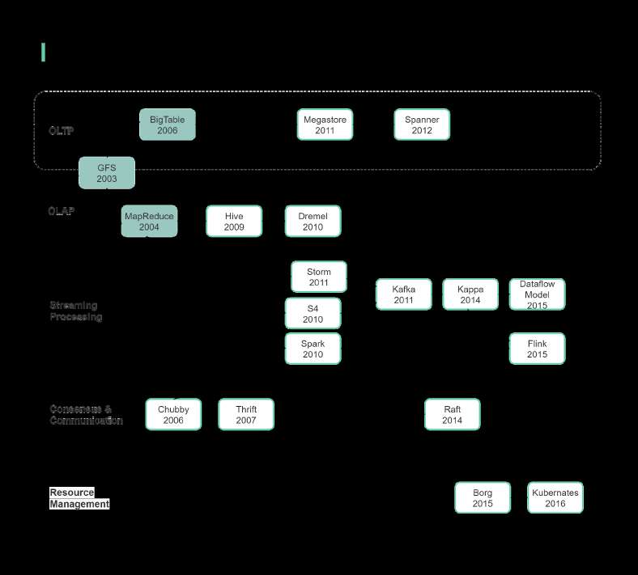

# Big data papers

> **Source**: ByteByteGo — System Design compilation PDF

Below is a timeline of important big data papers and how the
techniques evolved over time.
The green highlighted boxes are the famous 3 Google papers, which
established the foundation of the big data framework. At the high-level:
𝘉𝘪𝘨 𝘋𝘢𝘵𝘢 𝘛𝘦𝘤𝘩𝘯𝘪𝘲𝘶𝘦𝘴 = 𝘔𝘢𝘴𝘴𝘪𝘷𝘦 𝘥𝘢𝘵𝘢 + 𝘔𝘢𝘴𝘴𝘪𝘷𝘦 𝘤𝘢𝘭𝘤𝘶𝘭𝘢𝘵𝘪𝘰𝘯
Let’s look at the 𝐎𝐋𝐓𝐏 evolution. BigTable provided a distributed
storage system for structured data but dropped some characteristics of
relational DB. Then Megastore brought back schema and simple
transactions; Spanner brought back data consistency.
Now let’s look at the 𝐎𝐋𝐀𝐏 evolution. MapReduce was not easy to
program, so Hive solved this by introducing a SQL-like query

language. But Hive still used MapReduce under the hood, so it’s not
very responsive. In 2010, Dremel provided an interactive query engine.
𝐒𝐭𝐫𝐞𝐚𝐦𝐢𝐧𝐠 𝐩𝐫𝐨𝐜𝐞𝐬𝐬𝐢𝐧𝐠 was born to further solve the latency issue in
OLAP. The famous 𝒍𝒂𝒎𝒃𝒅𝒂 architecture was based on Storm and
MapReduce, where streaming processing and batch processing have
different processing flows. Then people started to build streaming
processing with apache Kafka. 𝑲𝒂𝒑𝒑𝒂 architecture was proposed in
2014, where streaming and batching processings were merged into
one flow. Google published The Dataflow Model in 2015, which was an
abstraction standard for streaming processing, and Flink implemented
this model.
To manage a big crowd of commodity server resources, we need
resource management Kubernetes.

