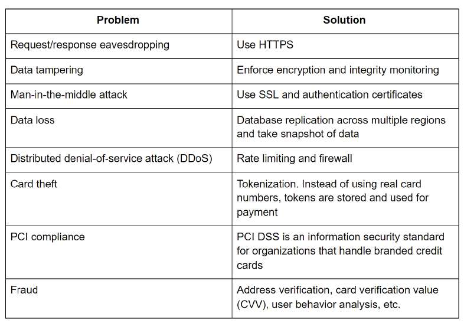

# Payment security

> **Source**: ByteByteGo — System Design compilation PDF

A few weeks ago, I posted the high-level design for the payment system. Today, I’ll continue the discussion and focus on payment security. The table below summarizes techniques that are commonly used in payment security. If you have any questions or I missed anything, please leave a comment.
