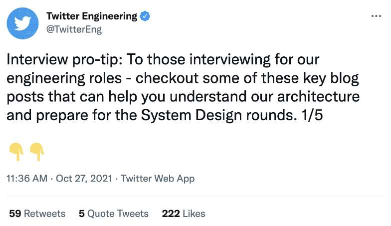

# System Design Interview Tip

> **Source**: ByteByteGo — System Design compilation PDF

One pro tip for acing a system design interview is to read the engineering blog of the company you are interviewing with. You can get a good sense of what technology they use, why the technology was chosen over others, and learn what issues are important to engineers. For example, here are 4 blog posts Twitter Engineering recommends: 1. The Infrastructure Behind Twitter: Scale 2. Discovery and Consumption of Analytics Data at Twitter 3. The what and why of product experimentation at Twitter 4. Twitter experimentation: technical overview
