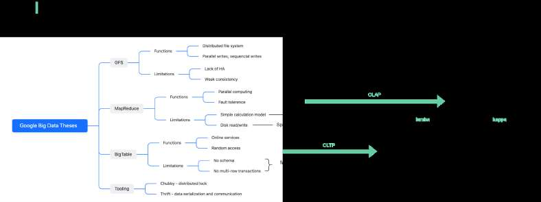

# Big data evolvement

> **Source**: ByteByteGo — System Design compilation PDF

I hope everyone has a great time with friends and family during the
holidays. If you are looking for some readings, classic engineering
papers are a good start.
A lot of times when we are busy with work, we only focus on scattered
information, telling us “how” and “what” to get our immediate needs to
get things done.
However, reading the classics helps us know “why” behind the scenes,
and teaches us how to solve problems, make better decisions, or even
contribute to open source projects.
Let’s take big data as an example.
Big data area has progressed a lot over the past 20 years. It started
from 3 Google papers (see the links in the comment), which tackled
real engineering challenges at Google scale:
- GFS (2003) - big data storage
- MapReduce (2004) - calculation model
- BigTable (2006) - online services
The diagram below shows the functionalities and limitations of the 3
techniques, and how they evolve over time into two streams: OLTP and
OLAP. Each evolved product was trying to solve the limitations of the

last generation. For example, “Hive - support SQL” means Hive was
trying to solve the lack of SQL in MapReduce.
If you want to learn more, you can refer to the papers for details. What
other classics would you recommend?

