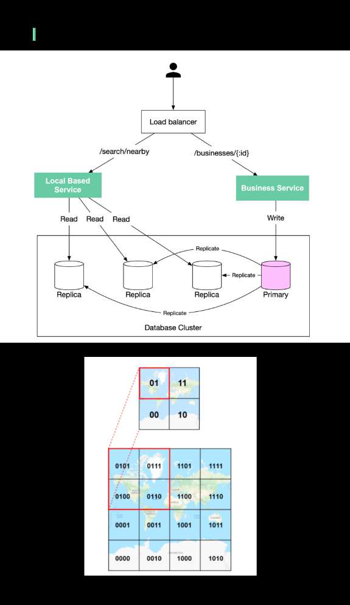
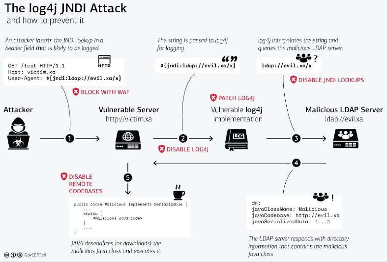
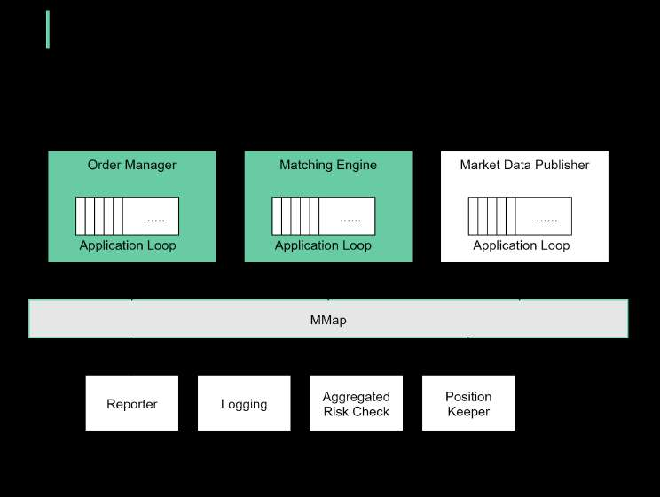

# How do we find nearby restaurants on Yelp?

> **Source**: ByteByteGo — System Design compilation PDF

Here are some design details behind the scenes.
There are two key services (see the diagram below):
- 𝐁𝐮𝐬𝐢𝐧𝐞𝐬𝐬 𝐒𝐞𝐫𝐯𝐢𝐜𝐞

- Add/delete/update restaurant information
- Customers view restaurant details
- 𝐋𝐨𝐜𝐚𝐥-𝐛𝐚𝐬𝐞𝐝 𝐒𝐞𝐫𝐯𝐢𝐜𝐞 (𝐋𝐁𝐒)
- Given a radius and location, return a list of nearby restaurants
How are the restaurant locations stored in the database so that LBS
can return nearby restaurants efficiently?
Store the latitude and longitude of restaurants in the database? The
query will be very inefficient when you need to calculate the distance
between you and every restaurant.
One way to speed up the search is using the 𝐠𝐞𝐨𝐡𝐚𝐬𝐡𝐚𝐥𝐠𝐨𝐫𝐢𝐭𝐡𝐦.
First, divide the planet into four quadrants along with the prime
meridian and equator：
- Latitude range [-90, 0] is represented by 0
- Latitude range [0, 90] is represented by 1
- Longitude range [-180, 0] is represented by 0
- Longitude range [0, 180] is represented by 1
Second, divide each grid into four smaller grids. Each grid can be
represented by alternating between longitude bit and latitude bit.
So when you want to search for the nearby restaurants in the
red-highlighted block, you can write SQL like:
SELECT * FROM geohash_index WHERE geohash LIKE `01%`
Geohash has some limitations. There can be a lot of restaurants in one
block (downtown New York), but none in another block (ocean). So
there are other more complicated algorithms to optimize the process.
Let me know if you are interested in the details.

One picture is worth more than a thousand words. Log4j from attack to
prevention in one illustration.
Credit GovCERT
Link:
https://www.govcert.ch/blog/zero-day-exploit-targeting-popular-java-libr
ary-log4j/

How does a modern stock exchange achieve
microsecond latency?
The principal is:
𝐃𝐨 𝐥𝐞𝐬𝐬 𝐨𝐧 𝐭𝐡𝐞 𝐜𝐫𝐢𝐭𝐢𝐜𝐚𝐥 𝐩𝐚𝐭𝐡！
- Fewer tasks on the critical path
- Less time on each task
- Fewer network hops
- Less disk usage
For the stock exchange, the critical path is:
- 𝐬𝐭𝐚𝐫𝐭: an order comes into the order manager
- mandatory risk checks
- the order gets matched and the execution is sent back
- 𝐞𝐧𝐝: the execution comes out of the order manager
Other non-critical tasks should be removed from the critical path.
We put together a design as shown in the diagram:

- deploy all the components in a single giant server (no containers)
- use shared memory as an event bus to communicate among the
components, no hard disk
- key components like Order Manager and Matching Engine are
single-threaded on the critical path, and each pinned to a CPU so that
there is 𝐧𝐨 𝐜𝐨𝐧𝐭𝐞𝐱𝐭 𝐬𝐰𝐢𝐭𝐜𝐡and ​𝐧𝐨𝐥𝐨𝐜𝐤𝐬
- the single-threaded application loop executes tasks one by one in
sequence
- other components listen on the event bus and react accordingly

