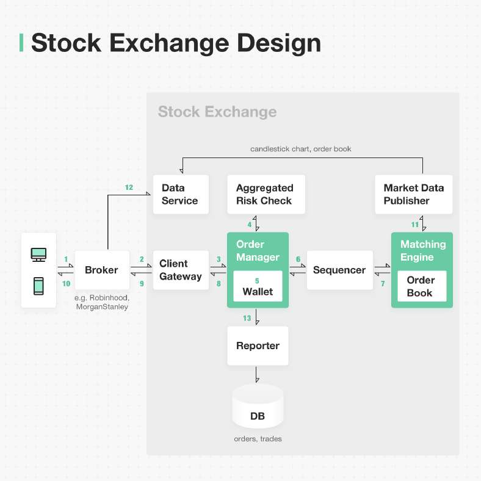

# Stock exchange design

> **Source**: ByteByteGo — System Design compilation PDF

The stock market has been volatile recently. Coincidentally, we just finished a new chapter “Design a stock exchange”. I’ll use plain English to explain what happens when you place a stock buying order. The focus is on the exchange side. Step 1: client places an order via the broker’s web or mobile app. Step 2: broker sends the order to the exchange.

Step 3: the exchange client gateway performs operations such as validation, rate limiting, authentication, normalization, etc, and sends the order to the order manager. Step 4: the order manager performs risk checks based on rules set by the risk manager. Step 5: once risk checks pass, the order manager checks if there is enough balance in the wallet. Step 6-7: the order is sent to the matching engine. The matching engine sends back the execution result if a match is found. Both order and execution results need to be sequenced first in the sequencer so that matching determinism is guaranteed. Step 8 - 10: execution result is passed all the way back to the client. Step 11-12: market data (including the candlestick chart and order book) are sent to the data service for consolidation. Brokers query the data service to get the market data. Step 13: the reporter composes all the necessary reporting fields (e.g. client_id, price, quantity, order_type, filled_quantity, remaining_quantity) and writes the data to the database for persistence A stock exchange requires **extremely low latency**. While most web applications are ok with hundreds of milliseconds latency, a stock exchange requires **micro-second levellatency**. I’ll leave the latency discussion for a separate post since the post is already long.
