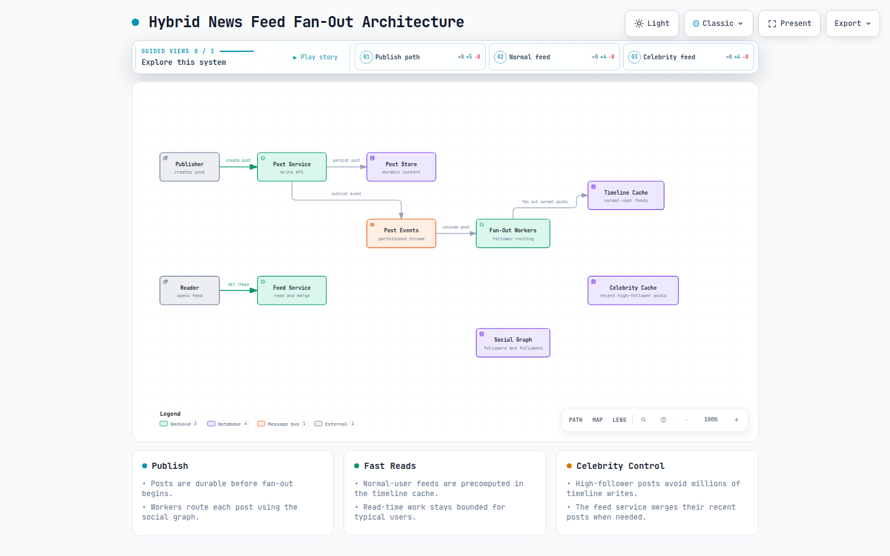

# Question 2: Design a Social Media News Feed System

**Answer:** Let's first understand the problem statement followed by our step-by-step and structured approach towards solutioning.

**Problem Statement:** We need to design the core newsfeed system for a social media platform (like LinkedIn/Facebook/X) that aggregates and displays a personalised stream of posts from accounts a user follows. The feed must support millions of concurrent users, deliver new posts with low latency, handle both organic and viral content and offer features like likes, comments and real‑time updates. The platform will have global scale with high availability.

> *Now, before jumping into the solution, you should ask clarifying questions. Here is an example conversation below —*

## Clarifying Questions & Answers (With Interviewer)

> **Candidate:** Before I dive into the design, I have several questions to clarify the scope, scale and detailed requirements.
> 
> **Interviewer:** Sure. go ahead.
> 
> **Candidate**: What type of content appears in the feed?  
> **Interviewer**: Only text, image and short video posts created by users. No ads, stories or recommended content (for now).
> 
> **Candidate**: Is the feed chronological or algorithmically ranked?  
> **Interviewer**: We should start with a reverse‑chronological feed and then later we can introduce a relevance model, but for now assume the feed timeline order by creation time.
> 
> **Candidate:** Do we need real‑time feed updates (push) or is the pull‑on‑refresh sufficient?  
> **Interviewer:** Pull on refresh is the minimum need for this system. We can later add notification of “new posts available” via WebSockets, but pull must return all recent posts within <200ms.
> 
> **Candidate:** What scale are we targeting here?  
> **Interviewer:** 500 million daily active users (DAU), each follows on average 300 accounts. Users create 2 posts per day on average and load their feed ~10 times per day.
> 
> **Candidate:** Are there any privacy settings?  
> **Interviewer:** Yes, user’s posts can be public, friends only or based on a custom list. The feed must respect visibility rules.
> 
> **Candidate:** Should the feed support likes/comments and do those affect the feed itself?  
> **Interviewer:** Likes and comments exist but they don’t change the feed ordering. The feed remains purely chronological. However, we need to show like/comment counts on each post.
> 
> **Candidate:** How quickly should a new post appear in followers’ feeds after creation?  
> **Interviewer:** Within 2–3 seconds (p99), but eventual consistency (up to 10 seconds) is acceptable for non‑celebrity users(content producers).
> 
> **Candidate:** Any storage limits for posts?  
> **Interviewer:** Text up to 10KB, images/videos up to 100MB. Media is stored separately from metadata.
> 
> **Candidate**: Thank! Now I have a clear picture. I’ll list my assumptions and proceed with the architecture followed by detailed solution.

## Assumptions

- **Traffic:** 500M DAU, each averages 10 feed loads/day → 5B feed requests daily. ~58,000 feed reads/sec average, peak 5× ≈ 290,000 reads/sec.
- **Writes**: 500M DAU × 2 posts/day = 1B new posts/day, ~11,600 posts/sec average, peak ~50,000 posts/sec.
- **Social graph:** Average 300 followers per user. 1% of users are “celebrities” with >1 million followers.
- **Feed ordering:** Reverse‑chronological by post creation time. No algorithmic re‑ranking in MVP.
- **Visibility**: Checked at write time (for push) and read time (for pull) to enforce privacy.
- **Latency**: Feed load p99 <200ms; post creation acknowledged <100ms.
- **Media Type**: Images/video hosted on a CDN, post metadata only stored in databases.

## Constraints

- **High availability:** 99.95% uptime for feed reads/writes.
- **Low latency:** Feed must load quickly globally, requiring edge caching and multi‑region deployment.
- **Eventual consistency:** Feeds may lag behind post creation by a few seconds; strong consistency needed only for the post author’s own timeline.
- **Cost**: Storage required for billions of posts, cache for active timelines and bandwidth for media must be optimised.
- **Write amplification:** Fanning out posts from celebrities to millions of followers is expensive; a hybrid approach is required in this case.

## Functional Requirements

**Post creation:** Users can publish text, image or video posts.

**Follow/Unfollow:** Users can follow/unfollow other accounts. The user’s own feed needs to update accordingly.

**Feed retrieval:** Return a paginated list of recent posts from all followed accounts, in reverse‑chronological order.

**Like/Comment:** Users can like and comment on posts; aggregated counts are shown on the post.

**Privacy:** Posts respect visibility settings(only intended audiences can see).

**Real‑time notifications:** Alert users that new feed items are available (this is a stretch requirement).

## Non‑Functional Requirements

- **Scalability:** Horizontal scaling to handle spikes and long‑term growth, especially for celebrity post fanout.
- **Performance**: p99 feed load <200ms; post creation p99 <100ms.
- **Consistency**: Causal consistency for feed updates; strong consistency for post creation and own‑profile views.
- **Durability**: Once a post is created, it must not be lost.
- **Security**: Authentication, rate limiting, spam detection, content moderation hooks to be integreted in the system.
- **Operability**: Distributed tracing, comprehensive metrics, automated capacity planning.

## Back-of-the-Envelope Estimations


Back of the Envelop Estimation Notes

> We can see that the biggest challenge is the ‘write‑side fanout’! We must distribute ~3.5M feed insertions per second to followers’ timeline caches. For celebrities, we will avoid write fanout entirely for now.

## High‑Level Architecture

**The system will have a hybrid fanout model:**

- **Fanout on write** (push) for users with small to medium follower count (≤ 10k). When they post, the post ID is written directly into the Redis timeline of each follower.
- **Fanout on read** (pull) for high‑profile users (celebrities). Their posts are only stored in their own “user‑posts” timeline. When a follower(of a celebrity) loads their feed, the system will merge the below:
1. Their pre‑computed timeline (regular users’ posts)
2. Recent posts from followed celebrities (fetched on‑demand, rate‑limited).

> This hybrid design will help minimise the write amplification while keeping read latency low.

### Architecture diagram:



**Diagram description:** A post is stored before asynchronous fan-out. Fan-out workers precompute timelines for normal users, while the dedicated celebrity cache supports read-time merging to avoid extreme write amplification for high-follower accounts.

[Open the interactive hybrid news-feed architecture diagram](resources/news-feed/news-feed-hybrid-fanout.html)


High Level Architecture Design

### Key flows:

**Post Creation & Fanout (Write Path)**


Sequence Diagram — Write Path

**Feed Retrieval (Read Path)**


Sequence Diagram — Read Path

> **CelebsCache** is a separate Redis cluster keyed by celebrity ID, holding their latest N posts. This cluster will be refreshed when a celebrity posts and read via a lazy caching approach on feed load (or a background job that do pre‑warms for celebrities!).

## API Design

All endpoints are versioned (`/api/v1`) and use OAuth 2.0 bearer tokens.

### Create Post API

- **Request:** `POST /api/v1/posts`
- **Body (multipart/form-data):** `content` (text, max 10KB), `media` (optional file), `visibility` (public/friends/private).
- **Response** `201`:
```c
{
  "post_id": "p_abc123",
  "author_id": "u_42",
  "created_at": "2026-05-02T12:00:00Z",
  "content": "Hello world!",
  "media_url": "https://cdn.social.com/media/img123.jpg"
}
```

### Get Feed API

- **Request**: `GET /api/v1/feed?cursor=<timestamp>&limit=20`

> Cursor is the `created_at` timestamp of the last post seen (for reverse‑chronological pagination requirement).

- **Response** `200`:
```c
{
  "data": [
    {
      "post_id": "p_xyz",
      "author": { "id": "u_100", "name": "Jane" },
      "content": "…",
      "created_at": "2026-05-02T11:59:00Z",
      "like_count": 59,
      "comment_count": 17,
      "media_url": null
    }
  ],
  "next_cursor": "2026-05-02T11:58:30Z"
}
```

### Follow/Unfollow API

- **Request(Follow)**: `POST /api/v1/users/{id}/follow`
- **Request(Unfollow)**: `DELETE /api/v1/users/{id}/follow`
- **Response:** Update user’s social graph & trigger asynchronous fanout of future posts from that user (or cleanup on unfollow).

### Like/Comment API

- **Request(Like)**: `POST /api/v1/posts/{id}/like`
- **Request(Comment)**: `POST /api/v1/posts/{id}/comments`
- **Response(Like):** Return updated counts. Counts are updated in Posts DB and eventually reflected in feed hydration.

## Data Model

### Posts Table (Cassandra)


Posts Table Schema

### Materialised view (user\_posts\_by\_time)


Materialised view user\_posts\_by\_time

### Social Graph DB (Neptune / Composite DB)

- Stored as a graph for efficient traversals. For the MVP we can model follow relationships in a wide‑column store (Cassandra) with two tables:
- `followers` (followee\_id → set<follower\_id>) & `following` (follower\_id → set<followee\_id>). A follower count table will be maintained to decide celebrity status.

### Timeline Cache (Redis Sorted Sets)

- **Key**: `timeline:{user_id}`
- **Members**: `post_id` with score = `created_at` timestamp (milliseconds). Sorted by score descending for reverse‑chronological order.
- **Max size per timeline**: 1000 posts. Older posts are trimmed on insertion.
- **Expiry**: idle timelines TTL 30 days.

### Celebrity Post Cache (Redis List)

- **Key**: `celebrity_posts:{celebrity_id}` (list of post IDs, max 100). [Lpush](https://redis.io/docs/latest/commands/lpush/) on new post, [Ltrim](https://redis.io/docs/latest/commands/ltrim/). TTL = 7 days with lazy refresh on read miss.

### Analytics / Counters

- Like/comment counts stored in Cassandra as counter columns (or a separate Redis hash for hot counts).

### Design Deep Dives

## Tech Stack Options

- **Backend**: Go (fast, concurrency) or Java with reactive frameworks.
- **API Gateway/CDN**: CloudFront + Application Load Balancer.
- **Container Orchestration**: Kubernetes (EKS/GKE).
- **Primary Data Store**: Apache Cassandra (for posts, social graph) — horizontally scalable, multi‑DC.
- **Graph Database**: Amazon Neptune (optional; for complex graph queries we can start with Cassandra).
- **Timeline Cache:** Redis Cluster (managed ElastiCache) — each shard holds a fraction of user timelines.
- **Celebrity Cache**: Redis (separate cluster to isolate celebrity load).
- **Message Queue:** Apache Kafka (high throughput, durability).
- **Fanout Workers:** Kubernetese‑deployed consumers (Go).
- **Media Storage:** S3 + CloudFront CDN.
- **Monitoring**: Prometheus, Grafana, Elasticsearch, OpenTelemetry.

## Consistency vs. Availability Trade‑offs

### Post creation & own profile:

- **Strong consistency required:** after posting, the author must see their own post immediately on their profile or timeline. The write to Cassandra is synchronous and the post is directly inserted into the author’s own timeline cache (write‑through). So we have CP(Consistency & PArtition Tolerence) for this step.

### Feed (followers):

- The hybrid fanout model is AP(Availability & Partition Tolerance) — eventual consistency. A post appears in followers’ feeds after the fanout worker processes the Kafka event (usually under 1 second). During a Kafka/fanout delay, followers won’t see the new post, which is acceptable.
- For celebrity posts, they are pulled at feed read time, so the moment the post is written to Cassandra and the celebrity cache is updated (eventually), all followers will see it on next refresh.
- Feed reads query Redis sorted sets and have no cross‑partition coordination; they are highly available.

### Social graph changes:

- Follow/unfollow is strongly consistent (Cassandra write). However, the effect on fanout (stop receiving future posts) is asynchronous: a fanout worker cleans up the timeline after an unfollow event. Again, eventual consistency is should be fine.

Hence writes to the post author are CP while feeds are AP.

## Failure Modes & Mitigations

### Decision Tree (for feed read resilience):


Feed read resilience- Decision Tree

## Security

- **Authentication**: OAuth 2.0 / JWT tokens; short‑lived access tokens.
- **Authorization**: Full CRUD on own posts; read only for feeds. Privacy checks at fanout time (store only for permitted followers) and at read time (filter by visibility). This ensures users cannot see friends‑only posts from non‑friends.
- **Rate limiting**: Per user per endpoint (for instance, 10 post creations/minute, 100 feed loads/minute) to prevent abuse.
- **Input validation:** Sanitize text content, scan uploaded media for malware.
- **Spam/Abuse:** Integrate async moderation using ML model; flag or remove offensive content.
- **Encryption**: HTTPS everywhere; media URLs signed with short‑lived tokens to prevent [hotlinking](https://en.wikipedia.org/wiki/Inline_linking).

## Monitoring & Observability

### Golden Signals:

- Feed read latency p50/p99, fanout lag (Kafka consumer offset lag).
- Post creation success/error rate.
- Cache hit ratios (timeline, celebrity).
- Throughput of Kafka topics.

### Business Metrics:

- Posts created/min, feed loads/min.
- Follows/unfollows per user.
- Celebrity fanout timings.

### Distributed Tracing:

- Trace from API gateway through fanout, Kafka, to cache updates (we can use OpenTelemetry for this).

### Alerts:

- Fanout lag > 5 seconds triggers scaling.
- Redis cluster CPU > 80%.
- Cassandra pending compactions high.
- p99 feed latency > 300ms for 5 minutes.

## Deployment / CI‑CD


Deployment Design — CI/CD

- **Multi‑Region Active‑Active:** Deploy full stack in at least 3 regions (for instance deploy in us‑east, eu‑west & ap‑southeast). Route users via geo‑DNS (Route 53) to nearest region.
- **Cassandra**: Multi‑region replication with NetworkTopologyStrategy, RF=3 in each DC. Writes use local quorum; reads local quorum (for feed, can use [ONE](https://docs.apigee.com/private-cloud/v4.53.01/about-cassandra-replication-factor-and-consistency-level) for faster reads, risking stale data).
- **Redis timelines:** Regional clusters only; feed loads are served locally. Fanout writes must update followers’ timelines in all regions where they reside. This can be achieved by having fanout workers in each region consume from a global Kafka (or by regional Kafka topics).
- Fanout writes only to the local region’s Redis; feeds are local and always consistent per region because a user’s timeline is stored where that user’s profile lives. If a user moves region, their timeline may need migration (rare, can be rebuilt). Alternatively, use a global Redis (cross‑region) but latency increases. For social media, it’s acceptable that a user loads their feed from the region they logged in from; their timeline is built in that region (via fanout or migration). This is a design choice!
- **CI/CD:** GitOps with ArgoCD & canary deployments.
- **Testing**: Integration tests with staging environment. Load tests using custom scripts.

## Cost/Operational Trade‑offs

**Fanout‑on‑write vs. Fanout‑on‑read:**

- *Full fanout on write* (push for all) would generate 300× more writes to Redis (for each post, 300 insertions), leading to a huge Redis cluster and network costs. For celebrities, 1M \* 11.6k posts would become impossible to handle.
- *Full fanout on read* (pull for all) would make feed load very slow (fetching from 300+ user timelines, merging). Not acceptable for latency.

> **Hybrid balances both the above scenarios:** normal users (99% of writes) fanout on write; celebrities (1% of users, but high followers) fanout on read. Reduces total fanout work by ~90% while keeping feed load fast. The cost is additional complexity and a separate celebrity cache.

**Timeline cache vs. DB‑only:**

- Without cache, every feed load would require heavy Cassandra joins. Redis adds cost but reduces latency from 100ms+ to <5ms per timeline fetch.

**Regional fanout vs. global fanout:**

- If timelines are regional, fanout only needs to write to one region’s cache, reducing cross‑region traffic. However, if a user travels, their feed may be empty until rebuilt. We can rebuild on first feed load by pulling from their followed users’ timelines (expensive but rare). Acceptable trade‑off!

**Media storage:**

S3 intelligent‑tiering and CDN keep will keep costs manageable.

## Testing Strategies

- **Unit tests:** Write tests fortimeline merge logic, visibility filtering & cursor pagination.
- **Integration tests:** Spin up Cassandra, Redis, Kafka in containers; test full post‑to‑feed flow.
- **Load tests:** Simulate 300k concurrent feed reads while injecting 50k posts/sec; measure p99 latency and fanout lag.
- **Chaos/Resilience tests:** Kill Redis primaries, Kafka brokers; simulate network partitions between regions.
- **Soak tests:** Run typical workload for 48h to detect memory leaks and Cassandra compaction issues.
- **Canary testing:** Deploy new fanout algorithm to 1% users and compare feed freshness/latency.

## Alternative Approaches

### Pure push (fanout on write) for all users:

Not scalable for celebrities; leads to hot partitions and unbounded write amplification.

### Pure pull (fanout on read) for all:

In this case, no fanout service, but feed load time grows linearly with number of followees. For 300 followees, merging is acceptable (<100ms) if caches are fast; but with 1000+ followers it will degrade significantly. Some platforms (like early Twitter) used a read‑based approach before switching.

### Materialised feeds in a columnar store:

Pre‑compute and store feeds in a wide‑column database (for instance, HBase). Each user’s feed is a row with many columns (post IDs). This is similar to Redis timelines but on disk, less performant.

### Graph database for feed generation:

Query the social graph directly at read time to fetch recent posts. This is slow without extensive caching.

### Use a timeline as an event stream (Kafka topic per user):

Each user’s feed is now a compacted Kafka topic. Reads become streaming consumers, too heavy for simple pull.

### Real‑time push via WebSockets:

Add server‑sent events or WebSocket connection to push new posts to active clients, reducing the need for frequent polling. Our design can be extended with this!

## References

[https://redis.io/docs/latest/commands/zremrangebyrank/](https://redis.io/docs/latest/commands/zremrangebyrank/)

[https://redis.io/docs/latest/commands/zadd/](https://redis.io/docs/latest/commands/zadd/)

[https://redis.io/docs/latest/commands/zrevrange/](https://redis.io/docs/latest/commands/zrevrange/)

[https://kafka.apache.org/42/design/design/](https://kafka.apache.org/42/design/design/)