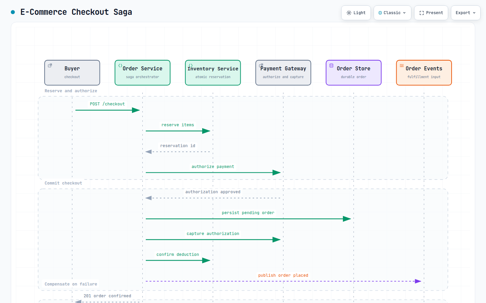

# Question 2: Design an E-Commerce Platform (like Amazon / Flipkart / eBay)

> *System design interviews for senior and distinguished engineering roles focus on the candidate’s ability to architect large-scale, complex systems under real-world constraints. Altogether, this technical blog will equip the candidate with a deep understanding of how to discuss, justify and diagram robust solutions to the complex system design problems.*

***Let’s get started!***

## Problem Statement

We need to design a scalable e‑commerce platform (similar to Amazon/Flipkart/eBay etc.) that enables customers to browse products, add items to a cart and place orders. The platform must handle a large product catalog, concurrent checkout sessions, inventory management and integrate with payment gateways. It must support millions of daily active users, guarantee no overselling of inventory and provide a resilient & low‑latency shopping experience.

## Clarifying Questions & Answers

> **Candidate:** Before I begin the design, I would like to clarify a few points to define the scope and validate my understanding of the problem statement.
> 
> **Interviewer**: Sure. Go ahead.
> 
> **Candidate:** What is the scale of the product catalog?  
> **Interviewer**: About 10 million active SKUs. Products belong to categories, have attributes like variants (size/color), availability and images.
> 
> **Candidate:** What type of traffic are we expecting?  
> **Interviewer**: 100 million daily active users, each viewing ~20 product pages and making 1 order every 10 days on average. So ~10 million orders/day.
> 
> **Candidate:** Do we need a real‑time inventory integration as well?  
> **Interviewer**: Yes, users must see accurate stock counts and overselling of a product must be prevented during checkout.
> 
> **Candidate:** What about search and filtering?  
> **Interviewer**: Full‑text search, [faceted](https://en.wikipedia.org/wiki/Faceted_search) filtering by category, brand, price range and ratings.
> 
> **Candidate:** How is payment handled?  
> **Interviewer**: We must integrate with external payment gateways (Stripe, PayPal etc.). The platform does not store raw credit card numbers, but stores a token.
> 
> **Candidate:** What are the order fulfillment requirements?  
> **Interviewer**: After payment, the order is sent to a fulfillment system; we need order status updates (placed, confirmed, shipped, delivered). Real‑time updates to be send to customer(push notifications via email or sms or with mobile app).
> 
> **Candidate:** Do we need user accounts and address management?  
> **Interviewer**: Yes, customers can have saved addresses and multiple payment methods. Guest checkout is also allowed.
> 
> **Candidate:** Do we have any specific performance goals for this system?  
> **Interviewer**: Product page load < 200ms (p95), search results < 100ms, checkout submission must be strongly consistent and durable.
> 
> **Candidate:** Perfect! I’ll now start outlining the solution.

## Assumptions

- **Catalog size**: 10 million products, each with multiple variants (average 3 variants per product) → ~30 million SKUs.
- **Traffic**: 100M DAU, 2 billion page views/day (20 per user). 10M orders/day (1 per 10 users per day). Peak load 3× average.
- **Products**: Each product has title, description, price, stock count, category, brand, images and attributes.
- **Search**: Users search by keyword, filter by facets. *Average search queries per day: 500 million*.
- **Carts**: Average cart size 3 items. Cart is persistent across sessions (logged‑in) or cookie‑based (guest).
- **Checkout**: Real‑time inventory reservation during order placement. If payment fails, inventory is released after a timeout.
- **Payment**: Third‑party tokenization; platform handles order status, not the raw card data.
- **Geographic**: Global, but assuming single region for MVP; solution can be extended.

## Constraints

- **Consistency**: Order/inventory operations must be strongly consistent; no overselling.
- **Latency**: Product pages and search must be extremely fast; checkout must feel instantaneous but can take up to 2 seconds (p95) due to payment.
- **Security**: PCI DSS compliance (tokenization), GDPR for user data.

## Functional Requirements

**Product Catalog:** Browse by category, view product details including images, variants, pricing and stock.

**Search**: Full‑text search with autocomplete, faceted filtering & sorting.

**Shopping Cart:** Add/remove items, persist cart for logged‑in users, merge guest cart on login.

**Checkout**: Capture shipping address, select payment method, apply discount/coupon, review order & submit.

**Order Management:** Order history, status tracking & cancellation (before shipping).

**Inventory Management**: Real‑time stock deduction during order, restocking with admin updates.

**Payment Integration:** Tokenize payment, capture/refund via gateway.

**Notifications**: Order confirmation, shipping updates (email/SMS/mobile app notifications).

## Non‑Functional Requirements

- **Availability**: 99.95% for browsing; 99.99% for order placement.
- **Scalability**: System to handle big shopping days like Black Friday/Cyber Monday etc. spikes (10× normal). Solution must scale horizontally for web tier, catalog, search & order services.
- **Performance**: p95 catalog page <200ms, search <100ms, checkout <2s.
- **Consistency**: Strong consistency for inventory and order writes; eventual for catalog updates.
- **Durability**: Once an order is placed, it must never be lost.
- **Resilience**: Retry queues for payment, dead letter queues for failed orders.
- **Operability**: Centralised logging, distributed tracing, health checks.

## Back‑of‑the‑Envelope Estimations

Estimations In Detail

> Read traffic is heavy on catalog/search; writes surge at checkout. The system must handle spikes without inventory inconsistencies.

## High‑Level Architecture

A microservices based architecture design will decouple the catalog browsing from the transactional order processing flows.

High Level — System Design

**Key flows:**

**Diagram description:** The checkout saga coordinates inventory and payment without a distributed transaction. It reserves items and authorizes payment first, persists and confirms the order only after capture succeeds, and releases the reservation when payment fails.

[Open the interactive e-commerce checkout saga diagram](resources/e-commerce-checkout/e-commerce-checkout-saga.html)

Sequence Design — Key Flows

- **Browse/Search:** Read‑heavy, served from Elasticsearch and CDN‑cached pages. Catalog service fetches product details and stock from cache.
- **Cart**: CRUD operations on Redis; cart data per user/guest key.
- **Checkout**: Orchestrated saga pattern: validate cart → reserve inventory → calculate total → tokenize payment → create order → capture payment → confirm inventory deduction. On failure, system must perform the compensating transactions and release inventory.

**Sequence Diagram:**

High Level — Sequence Diagram

**Sequencing of events:**

- The checkout flow is a saga pattern orchestrated by the Order Service.
- Inventory reservation uses an atomic SQL `UPDATE … WHERE available >= q` to prevent overselling. If the condition fails for any item, the entire reservation is rolled back (no partial reservation).
- Payment authorization (pre‑auth) is performed via an external gateway; the app never sees raw card details.
- After payment capture, the inventory reservation is confirmed (deducting the reserved quantity) and the order is marked `CONFIRMED`.
- If payment capture fails after authorization, the Order Service calls the Inventory Service’s `/release` endpoint to return stock.
- An `OrderPlaced` event is emitted to Kafka for downstream fulfillment and notifications.
- The entire flow uses [idempotency](https://en.wikipedia.org/wiki/Idempotence) keys from the client to safely retry.

> This saga guarantees that either all steps succeed or compensating actions restore consistency hance maintaining strict inventory accuracy.

## API Design

### Product Catalog API

> **Request**: `GET /api/v1/products?category=...&page=...&size=...`
> 
> **Response**: paginated product listings.
> 
> **Request:** `GET /api/v1/products/{id}`
> 
> **Response:** product details with variants, stock, images.
> 
> **Request:**`GET /api/v1/products/search?q=...&filters=...`
> 
> **Response:** search with filters.

### Cart API

> **Request**:`GET /api/v1/cart`
> 
> **Response**: get current cart (pull user from token or session).
> 
> **Request**:`POST /api/v1/cart/items`
> 
> **Response**: added item `{ "product_id", "variant_id", "quantity" }`.
> 
> **Request**:`PUT /api/v1/cart/items/{itemId}`
> 
> **Response**: updated quantity.
> 
> **Request**: `DELETE /api/v1/cart/items/{itemId}`
> 
> **Response**: remove item with {itemId}.

### Orders API

> **Request**: `POST /api/v1/orders` — submit order: body `{ "shipping_address_id", "payment_method_id", "coupon_code" }`
> 
> **Response:** Returns order ID and status.
> 
> **Request**: `GET /api/v1/orders`
> 
> **Response**: list user orders.
> 
> **Request**: `GET /api/v1/orders/{id}`
> 
> Response: returns order details.
> 
> **Request**: `POST /api/v1/orders/{id}/cancel` – cancel if allowed(item not shipped yet).
> 
> **Response**: return confirmation of cancellation.

### Inventory (internal/admin) API

> **Request**: `PUT /api/v1/inventory/{sku_id}` – update stock level.
> 
> **Response**: Acknowledgment with updated stock level(optional)
> 
> **Request**: `POST /api/v1/inventory/reserve` – reserve stock (used by order service).
> 
> **Response**: Acknowledgment with updated stock level(optional)
> 
> **Request**:`POST /api/v1/inventory/confirm` – confirm deduction.
> 
> **Response**: Acknowledgment with updated stock level(optional)
> 
> **Request**:`POST /api/v1/inventory/release` – release reserved stock.
> 
> **Response**: Acknowledgment with updated stock level(optional)

## Data Model

### Product Catalog (Elasticsearch + PostgreSQL)

Schema — Product Catalog

### Cart (Redis)

Schema — Cart

### Orders (PostgreSQL, sharded by user\_id)

Schema — Orders Tables

### Payment Tokens (PostgreSQL)

Schema — Payment Methods

### Design Deeps Dives

## Tech Stack

- **Frontend**: React / Next.js with SSR for SEO.
- **API Gateway**: Kong or AWS API Gateway (with rate limiting & auth).
- **Microservices**: Java (Spring Boot) or Go for high‑concurrency services.
- **Database**: PostgreSQL (with [Citus](https://docs.citusdata.com/en/stable/get_started/what_is_citus.html) for sharding orders/users), Elasticsearch for search, Redis for carts and cache.
- **Message Queue:** Apache Kafka for order events, payment capture, notifications.
- **Container Orchestration**: Kubernetes (EKS).
- **CDN**: CloudFront for images and static assets.
- **Monitoring**: Prometheus, Grafana, OpenTelemetry.

Multiple Tech Options Comparison

> **Elasticsearch vs PostgreSQL full‑text search:** ES is chosen for superior relevancy tuning and faceting at scale, though it introduces an eventual‑consistency gap that must be managed for stock status.
> 
> **Inventory in PostgreSQL vs Redis:** PostgreSQL’s strong consistency and atomic operations are critical to prevent overselling; Redis would be faster but risks inconsistency in complex transactions.
> 
> **Saga vs 2PC:** The saga pattern avoids distributed locks and long‑lived locks, at the cost of implementing compensating actions. Given that payment and inventory are separate services, sagas are more resilient.

## Failure Modes & Mitigations

### Inventory Reservation Failure (due to stock calculation issue):

Inventory Reservation Failure

### Payment Gateway Timeout:

Payment GW Failure

### Order DB Outage:

Order DB Failure

### Redis Cart Cluster Down:

Redis Cart Service Failure

### Search Cluster Down:

Product Search Cluster Service Failure

### Over‑Selling (due to concurrent reservations):

Overselling Issue

### Saga Compensation Failure:

SAGA Compensation Calls Failure Scenario

## Consistency vs. Availability Trade‑offs

- **Product catalog:** Highly available, eventually consistent. Stock status may be slightly out of date (for instance, last few items) but product pages must load fast. We should use a cache with TTL for stock.
- **Cart**: Available, tolerant to temporary inconsistencies; Redis is primary with no strong consistency needed.
- **Inventory & Order:** Strong consistency required. Inventory reservation uses optimistic locking or atomic DB operations (UPDATE stock SET available = available — q WHERE sku\_id=? AND available >= q). If the update fails, the order fails. The order service orchestrates a saga to either confirm or release reservation, keeping the system consistent.
- **Payment**: The payment gateway interface requires idempotency; the platform uses idempotency keys to ensure exactly‑one capture.

## Security

- **Transport**: HTTPS/TLS everywhere.
- **Authentication**: OAuth 2.0 / JWT. For guests, short‑lived session tokens.
- **Payment**: Integrate with PCI‑compliant SDKs; tokens only (never log [PAN](https://stripe.com/resources/more/primary-account-numbers)).
- **Data privacy:** PII encrypted at rest and in transit. GDPR‑compliant data export/deletion.
- **Abuse**: Rate limiting on add‑to‑cart and checkout endpoints; use CAPTCHA on checkout if suspicious activities detected.

## Monitoring & Observability

- **Golden signals:** Search latency, product page load time, checkout success rate, inventory negative count (0) and cart abandon rate.
- **Business metrics:** Orders per minute, revenue, top selling products etc.
- **Alerts**: Order failure rate > 1%, inventory reservation failures spike, payment gateway error rate > 5% etc.

## Deployment / CI‑CD

- **Infrastructure**: Terraform for cloud resources, Kubernetes for services.
- **CI**: GitLab/GitHub Actions run tests, build containers.
- **CD**: ArgoCD for GitOps; canary deployments for critical services (order, inventory). Feature toggles for gradual rollouts.

## Cost / Operational Trade‑offs

- **Elasticsearch vs. built‑in PostgreSQL full‑text:** Elasticsearch offers superior relevancy and faceting but adds operational complexity. For 10M products, PostgreSQL full‑text can work, but we should choose ES for better search UX.
- **Separate inventory DB vs. in‑memory:** We are using Redis for inventory with [Lua scripts](https://redis.io/docs/latest/develop/programmability/eval-intro/) can be faster than PostgreSQL, but PostgreSQL offers durability and easier transactional integrity. We need to use PostgreSQL with strong consistency; hot inventory rows can be cached in Redis for read, but writes go to DB.
- **Caching product pages:** We can cache full product pages on CDN edge for anonymous users. For logged‑in users (personalized recommendations), it’s more complex; hence we can cache fragments.

## Testing Strategies

- **Unit tests:** Business logic in order service (discount calculation, inventory validation etc).
- **Integration tests:** Test saga orchestration with payment simulator.
- **Load tests:** Simulate 100k concurrent users browsing and checking out (measure p99).
- **Chaos tests:** Kill inventory DB pod, verify order service handles gracefully; kill Kafka broker, verify retry logic and similar other crital logics.

## Alternative Approaches

1. **Monolithic architecture —** It is simpler to start, but harder to scale and evolve. Many e‑comm startups begin here and then extract services.
2. **Use managed search service (Algolia/AWS CloudSearch)** — reduces ops burden but less control.
3. **Event sourcing for orders** — full event log of order state changes; powerful but more complex.
4. **CQRS with materialized views** — separate read models for order history, catalog; this can be added later.
5. **Reserve inventory at cart addition** — prevents seeing out‑of‑stock after adding to cart, but causes inventory hoarding. Instead we need to only reserve at checkout with a short lock (5 mins), refreshing on cart interaction.

*If the above content helped you in your interview preparation, give it a high five!*

## REFERENCES

## [PART 1 — Distinguished Engineer — Behavioural Interview Questions](https://medium.com/@rameshwar.blog/part-1-distinguished-engineer-behavioural-interview-questions-323af57f1d53?source=post_page-----dec372b79967---------------------------------------)

### Welcome back folks! In this new tech blog I am putting down real world experienced based behavioural interview…

medium.com

## [PART 2 — Distinguished Engineer — System Design Interview Questions (URL Shortener & News Feed…](https://medium.com/@rameshwar.blog/part-2-distinguished-engineer-system-design-interview-questions-ec2cec657e11?source=post_page-----dec372b79967---------------------------------------)

### System design interviews for senior and distinguished engineering roles focus on the candidate’s ability to architect…

medium.com

[https://patroni.readthedocs.io/en/latest/README.html](https://patroni.readthedocs.io/en/latest/README.html)