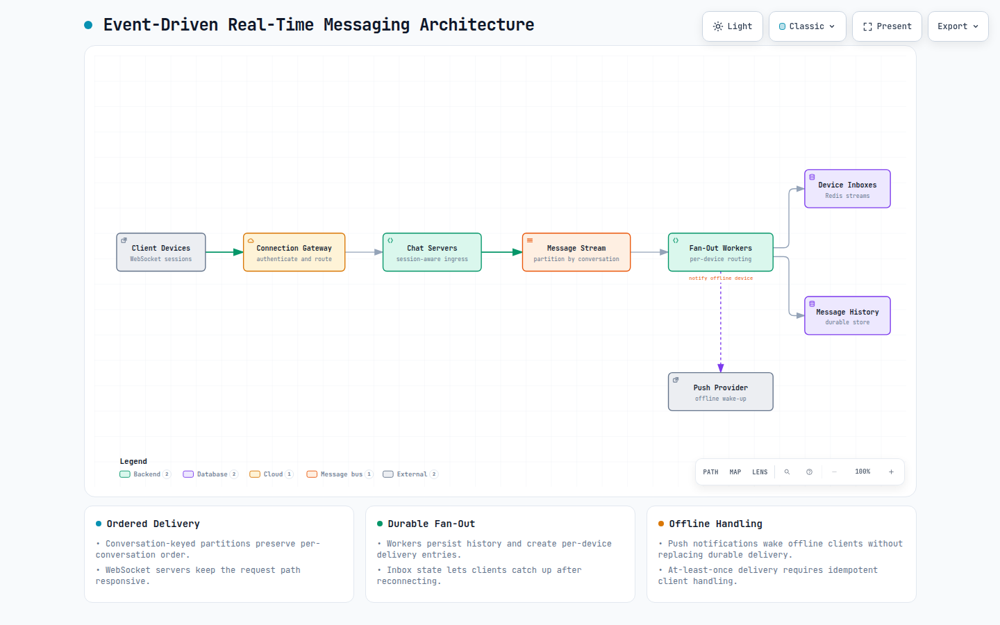

# Question 1: Design a Real-Time Messaging System (like WhatsApp)

> *System design interviews for senior and distinguished engineering roles focus on the candidate’s ability to architect large-scale, complex systems under real-world constraints. Altogether, this technical blog will equip the candidate with a deep understanding of how to discuss, justify and diagram robust solutions to the complex system design problems.*

***Let’s get started!***

## Problem Statement

We need to design a real‑time messaging platform (like WhatsApp, Messenger or Telegram) that allows users to send text and media messages to individuals and groups. Messages must be delivered in real time to online recipients and reliably queued for offline users. The system must support delivery receipts, read receipts, multi‑device sync and history persistence at a global scale with millions of concurrent active users.

## Clarifying Questions & Answers

> **Candidate:** Before I begin the design, I would like to clarify a few points.
> 
> **Interviewer**: Sure. Go ahead.
> 
> **Candidate**: What types of conversations should we support?  
> **Interviewer**: One‑to‑one direct messages and group chats with up to 256 members.
> 
> **Candidate:** What content types/formats need to be supported?  
> **Interviewer**: Text (up to 4096 characters), images, short videos and files up to 100 MB per message.
> 
> **Candidate:** Do we need multi‑device support?  
> **Interviewer**: Yes, users can be logged in on up to 5 devices simultaneously and all messages must sync across devices in real time.
> 
> **Candidate:** What are the delivery guarantee requirements?  
> **Interviewer**: At‑least‑once delivery within a conversation, with per‑conversation ordering. No global ordering required. The sender should see delivery status (sent, delivered & read).
> 
> **Candidate:** What about offline delivery?  
> **Interviewer**: If the recipient is offline, the message should be stored and pushed when they come online. Push notifications should wake up the app.
> 
> **Candidate:** How long should the message history be retained?  
> **Interviewer**: Indefinitely; users can scroll back years. Need pagination for message history. Take 5 years as historical window for MVP.
> 
> **Candidate:** What are the expected scale numbers?  
> **Interviewer**: 200 million daily active users (DAU). Each user sends 30 messages/day on average. **Peak concurrency**: 20 million simultaneous WebSocket connections.
> 
> **Candidate:**Any special security requirements I must address in the design?  
> **Interviewer**: Basic security is a bare minimum: authentication, encryption in transit. End‑to‑end encryption (E2EE) would be a plus but can be treated as an extension for now.
> 
> **Candidate:** Should we support [typing indicators](https://support.signal.org/hc/en-us/articles/360020798451-Typing-Indicators) and presence(online/offline status)?  
> **Interviewer**: Typing indicators and online presence are nice‑to‑have feature for a modern messaging system but not mandatory for the MVP; we can add them later.
> 
> **Candidate:**: Thank you. That gives me everything I need. I’ll now start outlining the system.

## Assumptions

- **DAU**: 200 million.
- **Messages per day:** 200M × 30 = 6 billion. Peak 5×: 30 billion/day hypothetical max.
- **Concurrent connections**: 20 million WebSocket connections at peak.
- **Message size:** Text average 100 bytes; media messages store metadata only; media files uploaded to separate blob storage.
- **One‑to‑one and group chats**: Groups up to 256 members.
- **Ordering**: Within a conversation (chat), messages are strictly ordered by server timestamp; client clocks are not trusted.
- **Multi‑device:** Full history sync; devices subscribe to the same user’s message stream.
- **Network**: Clients on mobile (unreliable connections) must handle reconnection smoothly.
- **Read receipts:** Show when the message was read by the recipient; server tracks the last read position per conversation per user.

## Constraints

- **Real‑time latency:** Message delivery to online recipient SLA < 200 ms (p95) for text.
- **Ordering**: All devices of a user see the same conversation order.
- **Scalability**: Horizontal scaling to handle spikes and long‑term growth.
- **Cost**: Efficient handling of long‑lived WebSocket connections.

## Functional Requirements

**Send message**: Client sends text/media message to a conversation (1:1 or group).

**Receive message:** Real‑time push to online recipients; queued for offline.

**Conversation history:** Paginated retrieval of past messages.

**Multi‑device sync:** All user’s devices receive the same messages in real time.

**Delivery receipts:** Sender gets confirmation that the message reached the server (sent) and the recipient (delivered).

**Read receipts:** Update when the recipient reads the message.

**Group messaging:** Send a message to all group members(fan‑out to be handled by server).

**Media sharing:** Upload media and send a link; thumbnail generation.

**(Stretch Requirement) Presence & ETE:** Typing indicators, online presence and end‑to‑end encryption.

## Non‑Functional Requirements

- **Latency**: p95 message delivery < 200 ms for online users.
- **High availability:** 99.95% uptime for messaging; no lost messages after server acknowledge.
- **Durability**: At‑least‑once delivery. Once accepted by the server, the message must never be lost.
- **Scalability**: Support 20M concurrent connections; handle fan‑out to large groups.
- **Consistency**: [Causal ordering](https://en.wikipedia.org/wiki/Causal_consistency) per conversation; eventual consistency for multi‑device reads.
- **Security**: Authentication (OAuth2/JWT), TLS, optional [E2EE](https://www.ibm.com/think/topics/end-to-end-encryption) (end to end encryption).
- **Operability**: Monitoring of connection counts, delivery latencies, queue depths.

## Back‑of‑the‑Envelope Estimations

Back-of-the-Envelop Estimations

> Our system must sustain high write throughput and maintain a massive number of persistent connections.

## High‑Level Architecture

This design separates the real‑time channel (WebSocket) from the persistent storage and message fan‑out using an event‑driven & decoupled architecture.

### Architecture Diagram:

**Diagram description:** WebSocket clients enter through a connection gateway and chat servers. Messages are appended to a conversation-partitioned stream, then fan-out workers persist history, create durable per-device inbox entries, and use push notifications only to wake offline clients.

[Open the interactive real-time messaging architecture diagram](resources/real-time-messaging/real-time-messaging-architecture.html)

High Level Design

**Core components:**

- **API Gateway** — terminates TLS, routes WebSocket upgrades and REST calls.
- **Chat Servers** — a fleet of stateful servers that maintain WebSocket connections to clients. They receive messages from clients, publish to Kafka and push messages to recipient connections.
- **Message Queue (Kafka)** —A durable, ordered log that receives all incoming messages. The topic uses a fixed pool of physical partitions (like 256), with messages keyed by `conversation_id`. This utilizes Kafka's default hashing partitioner to guarantee that all messages for a specific conversation map to the same partition, ensuring strict chronological ordering without partition sprawl!

> **Kafka Under the Hood:**
> 
> **Fixed Partitions:** We spin up a topic called `chat-messages` with a static count, say, **256 partitions**. This number remains constant regardless of whether we have 100 conversations or 100 million.
> 
> **The Hashing Strategy:** When a user sends a message, the Kafka Producer uses its default partitioner. It runs the `conversation_id` through a hashing algorithm (like [MurmurHash2](https://en.wikipedia.org/wiki/MurmurHash)) and mods it by the total number of partitions:
> 
> `Partition = Abs(Hash(conversation_id)) % Total_Partitions`
> 
> **Guaranteed Ordering:** Since the hashing algorithm is deterministic, **every single message with the same** `**conversation_id**` **will always land on the exact same physical partition!**

- **Message Processor (Fan‑out Worker)** — consumes from Kafka and determines delivery targets: writes to recipient inbox queues or triggers push notifications.
- **User Presence Service** — tracks online/offline status and which Chat Server holds the connection for each device.
- **Push Notification Service** — sends push notifications ([APNs](https://en.wikipedia.org/wiki/Apple_Push_Notification_service) / [FCM](https://firebase.google.com/docs/cloud-messaging)) to offline devices.
- **Inbox Queues (Redis Streams)** — per‑device message queues holding undelivered messages.
- **Message Store (Cassandra)** — durable storage of all messages, partitioned by conversation ID.
- **Media Store** — S3/CDN for images, videos.

### Key flows:

High Level Sequence Design

**Sequence of Events:**

1. Sender pushes a message via WebSocket to the nearest Chat Server.
2. The Chat Server validates the message, assigns a global server timestamp and then publishes it to Kafka using a partition key of the conversation ID (for strict ordering).
3. After Kafka acknowledges, the sender receives an immediate ack — the message is now durable.
4. **Asynchronous fan‑out begins:** a Fanout Worker consumes the event from Kafka, looks up the conversation’s members and their active devices and writes the message summary to each device’s Redis Stream (`inbox:{user_id}:{device_id}`).
5. For each online recipient, the Chat Server holding that device’s WebSocket is already polling the Redis Stream with a blocking `XREADGROUP`. The new entry arrives instantly and is pushed to the recipient’s client.
6. The client acknowledges receipt, and the Chat Server marks the message as processed (`XACK`), which removes it from the pending entries list for that device’s consumer group.
7. If the recipient was offline, the message remains in the Redis Stream; once they reconnect, the stream’s pending entries are re‑delivered.

This design guarantees at‑least‑once delivery, per‑conversation ordering, and real‑time push to online devices while decoupling the write path from fan‑out.

## API Design

### WebSocket protocol (primary)

During the WebSocket connection, a custom binary/text protocol is used for commands:

- `{"type":"message_send", "conv_id":"u1-u2", "content":"Hello", "msg_id":"client_gen_123"}`
- Server responds with `{"type":"ack", "msg_id":"123", "server_ts":1715000000}`.
- **Incoming message:** `{"type":"new_msg", "conv_id":"u1-u2", "sender":"u1", "content":"Hello", "msg_id":"srv_456", "ts":1715000000}`.
- **Delivery receipt:** `{"type":"delivery", "msg_id":"srv_456", "to":"u2"}`.
- **Read receipt:** `{"type":"read", "conv_id":"u1-u2", "reader":"u2", "last_read_ts":1715000000}`.

### REST APIs (for history & media)

- `GET /api/v1/conversations` – list conversations with last message.
- `GET /api/v1/conversations/{id}/messages?before=<timestamp>&limit=50` – paginated history.
- `POST /api/v1/media/upload` – upload media, returns URL.
- `PUT /api/v1/conversations/{id}/read_cursor` – mark conversation as read.

## Data Model

### Cassandra — Messages Table

Schema Design — Messages Table

**Access pattern:** Retrieve messages by conversation, reverse chronological. Cassandra’s time‑based ordering is perfect.

### Redis Streams — Per‑Device Inbox

- **Key**: `inbox:{user_id}:{device_id}` – a Redis Stream.
- Each entry contains a serialized summary of the new message (conv\_id, message\_id, sender, preview). Messages are added by the Fan‑out Worker and acknowledged when the device confirms delivery.
- **Consumer group:** used by multi‑device to track which devices have processed the message.

### Presence Store (Redis Hash)

- `presence:{user_id}` → JSON map of `device_id` → `(chat_server_id, status, last_seen)`.
- **TTL**: updated on connect/disconnect.

### Design Deep Dives

## Tech Stack

- **WebSocket servers:** Erlang/Elixir (Phoenix) or Node.js/Go for high concurrency; Go with goroutines scales well. We’ll choose Go for performance and ecosystem.
- **Message Queue:** Apache Kafka (high throughput, message ordering by partition key `conv_id`).
- **Inbox & Cache:** Redis (Streams for per‑device message queues, pub/sub for presence, cache for hot conversations).
- **Primary Database:** Apache Cassandra (high write throughput, horizontal scale, multi‑DC).
- **Media Storage:** Amazon S3 + CloudFront.
- **Push**: Firebase Cloud Messaging / APNs.
- **Presence**: Redis with TTL + heartbeats.
- **Container Orchestration:** Kubernetes.
- **API Gateway:** [Kong](https://konghq.com/products/kong-gateway)
- **Monitoring**: Prometheus+Grafana+OpenTelemetry

Tech Stack Options

## Consistency vs. Availability Trade‑offs

- **Message sending & ordering:** Strong consistency within a conversation is achieved by routing all messages for a conversation through a single Kafka partition (partitioned by `conv_id`). The fan‑out worker processes events in order, and writes to inboxes and DB in order.
- **Multi‑device sync:** Inboxes per device ensure each device can independently catch up. Since they all read from the same Kafka log, the order is consistent across devices. Eventual consistency across devices is acceptable (a message might appear on phone a few milliseconds later than on desktop).
- **Delivery receipts:** At‑least‑once delivery; a message may be re‑delivered if a device acknowledges late, but client deduplication based on `message_id` handles this (Availability & Partition Tolerance/AP).
- **Offline users:** When they come online, they fetch missed messages from Redis Streams, which have been persisted. If Redis fails, we fall back to Cassandra history for catch‑up (slower). So availability prioritized for online delivery, consistency eventually for offline catch‑up.

## Failure Modes & Mitigations

### Chat Server Crash:

Failure Scenario — Chat Server Crash

### Kafka Broker Failure:

Failure Scenario — Kafka Broker Issue

### Fan‑out Worker Failure:

Failure Scenario — Fan‑out Worker Issue

### Redis Inbox Down:

Failure Scenario — Redis Inbox down

### Cassandra Node Down:

Failure Scenario — Cassandra Node Down

### Presence Service outage:

### Thundering Herd on Reconnection:

Failure Scenario — Thundering Herd on Reconnection

## Security

- **Transport**: WebSocket Secure (wss://) and HTTPS enforced.
- **Authentication**: OAuth 2.0 / JWT; token validated on WebSocket upgrade.
- **Authorisation**: User can only send to conversations they are a member of; Chat Server checks membership before accepting a message.
- **Input validation:** Message size limits, media type scanning.
- **Spam/Abuse**: Rate limiting per user (max 10 messages/sec). Integration with content moderation service.

## Monitoring & Observability

- **Golden Signals:** WebSocket connection rate, message send/receive latency, Kafka consumer lag, Redis Stream pending entries.
- **Business Metrics:** Messages sent per minute, deliveries per minute, active group chats, push notification success rate.
- **Distributed Tracing:** Trace a message from sender’s Chat Server through Kafka to fan‑out to recipient’s inbox and ack. OpenTelemetry.
- Alerts: Connection drops >5%, Kafka lag >1 minute, Redis memory usage >80%, Cassandra write timeout rate.

## Deployment / CI‑CD

- **Multi‑region:**

Deployment Multi Region

Deploy Chat Servers and Kafka clusters in multiple regions (us‑east, eu‑west, ap‑southeast). Users connect to nearest region. Cassandra multi‑DC replicates messages globally with eventual consistency. Conversations are sticky to the home region of the user who created the conversation; cross‑region delivery via [Kafka MirrorMaker](https://cwiki.apache.org/confluence/pages/viewpage.action?pageId=27846330) or a single global Kafka topic (latency trade‑off). For real‑time, we usually have regional chat servers that handle local users; a message from one region to another goes through global Kafka.

- **CI/CD:**

CICD Strategy

Containerised services, Helm charts, GitOps with ArgoCD. **Canary deployments:** upgrade a subset of Chat Servers, monitor metrics, then roll out.

## Cost / Operational Trade‑offs

- **WebSocket servers:** Keeping 20M connections alive requires significant memory and CPU. Using Go/ [Elixir](https://elixir-lang.org/) minimizes resource per connection. We can use dedicated hardware or cloud instances with high network bandwidth.
- **Redis Streams vs. Kafka direct push:** Using Redis Streams as per‑device inbox offloads long‑term message buffering from Kafka (which is log‑based, not great for per‑device checkpoints). But adds Redis cost. **Alternative:** use Kafka consumer groups per device, but that would mean millions of consumer groups — not feasible.
- **Fan‑out for group messages:** Instead of writing to every recipient’s inbox immediately (write amplification), we could fan‑out on read (store group message once and when user’s device pulls then merge group timeline). This reduces Redis write load but increases latency for group sync. **The compromise:** for small groups (< 100), perform fan‑out on write; for large groups, perform fan‑out on read from a group timeline stored in Cassandra. Our spec says groups up to 256, so fan‑out on write is acceptable (256X write amplification, but with Redis Streams it’s fast).

## Testing Strategies

- **Unit tests:** Protocol parsing, message ordering.
- **Integration tests:** Spin up Chat Server, Redis, Kafka; test send/receive and offline catch‑up.
- **Load tests:** Simulate 5M concurrent connections sending messages; measure latency and Kafka lag.
- **Chaos tests:** Kill Chat Servers, Redis nodes, Kafka brokers; verify no message loss.
- **Soak tests:** Run for 24h with realistic traffic to detect memory leaks.

## Alternative Approaches

1. **Peer‑to‑peer (P2P) messaging** — not suitable for multi‑device and offline delivery; requires complex NAT traversal.
2. **Use a single big database (e.g., PostgreSQL) for everything** —it can’t scale to write throughput or connection counts.
3. **No Kafka, direct Redis Pub/Sub** — loses ordering and durability guarantees; if subscriber down, message lost.
4. **Event sourcing with event store (Kafka) and materialised views** — we already use Kafka as source of truth, but it’s heavy to query directly for history; Cassandra acts as materialised view.
5. **Using a managed real‑time service (e.g., Firebase Realtime Database)** — simpler but less control, vendor lock‑in and may not meet enterprise scale/cost requirements.
