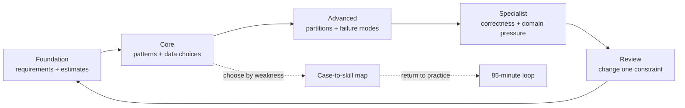

# System Design Case Preparation Guide

Use this guide to choose a case, structure a timed answer, and justify each architectural step with the workload it addresses. The linked case is the source of truth; this document is the preparation map.

> **Interview References**: [Roadmap](../system-design-architecture/system-design-interview/interview-roadmap.md), [Preparation Master Sheet](../system-design-architecture/system-design-interview/system-design-preparation-master-sheet-takeaways.md), [Deep Dive Reference](../system-design-architecture/system-design-interview/interview-deep-dive.md), [Decision Frameworks](../system-design-architecture/system-design-interview/complete-system-design-interview-guide-2026-takeaways.md), and [Review Plan](../system-design-architecture/system-design-interview/system-design-review-plan.md).

## Visual Dashboard

Use the interactive diagrams when you want the shape of the preparation plan at a glance. The Markdown view remains the source of truth for the catalog and heuristics.

| View | Best for | Interactive companion |
|:---|:---|:---|
| Preparation path | Choosing the next difficulty level and knowing when to branch | [Open the Archify preparation path](resources/preparation-path.html) |
| Case-to-skill map | Picking a case that exercises a specific weakness | [Open the Archify case-to-skill map](resources/case-skill-map.html) |

### Track a practice pass

Copy this small tracker beneath a case before starting. Check each item only after you can explain it aloud without reading the reference solution.

- [ ] Requirements and non-goals are explicit
- [ ] Average and peak load are estimated
- [ ] Entities, ownership, keys, and APIs are named
- [ ] Baseline read and write paths are traceable
- [ ] Highest-risk bottleneck has a mechanism and trade-off
- [ ] Retry, duplicate, overload, dependency, and region failures are covered
- [ ] First scaling limit and evolution trigger are stated

## Preparation Path

Work from **foundation** to **core**, then use **advanced** and **specialist** cases to test a specific weakness. Do not passively read a solution first.

1. Learn the [7-phase interview rhythm](../system-design-architecture/system-design-interview/interview-roadmap.md#sdi-01-the-7-phase-interview-rhythm): requirements, estimates, entities, APIs, high-level design, deep dive, and trade-offs.
2. Start with one foundation case and one core case. Draw a baseline before adding a cache, queue, replica, or shard.
3. Use the [85-minute practice loop](../system-design-architecture/system-design-interview/system-design-preparation-master-sheet-takeaways.md#sdi-33-the-9-step-practice-loop): clarify, estimate, draw, deep dive, scale, handle failure, compare, and record an improvement.
4. Run the relevant phase checks in the [review plan](../system-design-architecture/system-design-interview/system-design-review-plan.md) before reading a reference solution.
5. Re-solve the same case with one changed constraint: ten times more writes, a strict ordering requirement, a hot tenant, or a regional outage.

| Level | Goal | Typical evidence of readiness |
|:---|:---|:---|
| Foundation | Explain the common building blocks | Can state requirements, estimate load, and draw a simple end-to-end path |
| Core | Choose patterns from workload constraints | Can defend cache, queue, replication, and data-model choices |
| Advanced | Manage distributed trade-offs | Can explain partitions, failure recovery, hot keys, and operational limits |
| Specialist | Reason in a demanding domain | Can protect correctness, ordering, geography, or media/data pipelines |

## Interview Meta-Preparation

| Need | Use this reference | What to internalize |
|:---|:---|:---|
| Drive a 45-minute answer | [Interview Roadmap](../system-design-architecture/system-design-interview/interview-roadmap.md) | The 7 phases, scripts for requirements, estimates, APIs, and trade-offs |
| Build the study sequence | [Preparation Master Sheet](../system-design-architecture/system-design-interview/system-design-preparation-master-sheet-takeaways.md) | The six abilities, 5-layer model, highest-ROI topics, and practice loop |
| Deepen fundamentals | [Interview Deep Dive](../system-design-architecture/system-design-interview/interview-deep-dive.md) | Caching, CAP/PACELC, replication, sharding, and company-specific signals |
| Select an architecture deliberately | [Decision Frameworks](../system-design-architecture/system-design-interview/complete-system-design-interview-guide-2026-takeaways.md) | Vertical versus horizontal scale, cache strategy, fan-out, idempotency, rate limits, tenancy, CQRS |
| Self-review under time pressure | [System Design Review Plan](../system-design-architecture/system-design-interview/system-design-review-plan.md) | Phase-by-phase checks for scope, math, data, APIs, failure modes, and trade-offs |

## Case Catalog

### Foundations and interview method

| Level | Case | Primary skills |
|:---|:---|:---|
| Foundation | [Scale From Zero To Millions Of Users](bytebytego/02-scale-from-zero-to-millions-of-users.md) | Evolution from one server to load balancing, caching, replication, and sharding |
| Foundation | [Back-of-the-Envelope Estimation](bytebytego/03-back-of-the-envelope-estimation.md) | QPS, storage, bandwidth, cache capacity, and peak-load estimates |
| Foundation | [A Framework For System Design Interviews](bytebytego/04-a-framework-for-system-design-interviews.md) | Requirements, high-level design, deep dive, and trade-off narrative |
| Core | [Design Consistent Hashing](bytebytego/06-design-consistent-hashing.md) | Partition routing, rebalancing, virtual nodes, and hot partitions |
| Core | [Design A Unique ID Generator](bytebytego/08-design-a-unique-id-generator-in-distributed-systems.md) | Ordering, clock behavior, uniqueness, and coordination trade-offs |
| Foundation | [The Learning Continues](bytebytego/30-the-learning-continues.md) | Building a deliberate practice habit after the initial case set |

### Product, social, and commerce systems

| Level | Case | Primary skills |
|:---|:---|:---|
| Core | [URL Shortener](cases/part-2-url-shortener-system-design.md) | Read-heavy redirects, key generation, cache-aside, analytics, and global latency |
| Core | [ByteByteGo URL Shortener](bytebytego/09-design-a-url-shortener.md) | Hashing, ID generation, cache, and redirect-path reasoning |
| Core | [Social Media News Feed](cases/part-2-news-feed-system-design.md) | Feed reads, fan-out, ranking, cache design, and celebrity behavior |
| Advanced | [ByteByteGo News Feed](bytebytego/12-design-a-news-feed-system.md) | Fan-out on write versus read and timeline aggregation |
| Core | [E-Commerce Platform](cases/part-3-e-commerce-platform-system-design.md) | Catalog, cart, order flows, inventory, payments, and search |
| Specialist | [Payment System](bytebytego/27-payment-system.md) | Idempotency, ledgers, reconciliation, auditability, and failure handling |
| Specialist | [Digital Wallet](bytebytego/28-digital-wallet.md) | Double-spend prevention, balances, strong correctness, and settlement |
| Specialist | [Stock Exchange](bytebytego/29-stock-exchange.md) | Order matching, fairness, low latency, ordering, and market data |
| Specialist | [Hotel Reservation System](bytebytego/23-hotel-reservation-system.md) | Inventory contention, booking correctness, and compensation paths |

### Real-time, messaging, and asynchronous systems

| Level | Case | Primary skills |
|:---|:---|:---|
| Advanced | [Real-Time Messaging System](cases/part-3-real-time-messaging-system-design.md) | WebSocket connections, ordering, offline delivery, multi-device sync, and media |
| Advanced | [ByteByteGo Chat System](bytebytego/13-design-a-chat-system.md) | Connection routing, message storage, presence, and delivery guarantees |
| Core | [Notification System](bytebytego/11-design-a-notification-system.md) | Channel routing, templates, preferences, retries, and provider failure |
| Advanced | [Distributed Message Queue](bytebytego/20-distributed-message-queue.md) | Partitioning, consumer groups, retention, ordering, and backpressure |
| Advanced | [Distributed Email Service](bytebytego/24-distributed-email-service.md) | Asynchronous delivery, queues, deduplication, rate limits, and reputation |
| Core | [Rate Limiter](bytebytego/05-design-a-rate-limiter.md) | Token bucket, distributed counters, gateway placement, and `429` behavior |
| Advanced | [Real-Time Gaming Leaderboard](bytebytego/26-real-time-gaming-leaderboard.md) | Ranking data structures, write aggregation, real-time updates, and regional convergence |

### Search, crawling, content, and collaboration

| Level | Case | Primary skills |
|:---|:---|:---|
| Advanced | [Web Crawler](bytebytego/10-design-a-web-crawler.md) | URL frontier, politeness, deduplication, distributed workers, and storage |
| Advanced | [Search Autocomplete](bytebytego/14-design-a-search-autocomplete-system.md) | Prefix indexes, ranking, caching, and offline model updates |
| Specialist | [YouTube](bytebytego/15-design-youtube.md) | Upload pipelines, transcoding, CDN delivery, metadata, and recommendations |
| Advanced | [Google Drive](bytebytego/16-design-google-drive.md) | File synchronization, chunk storage, versioning, conflicts, and sharing |
| Specialist | [S3-like Object Storage](bytebytego/25-s3-like-object-storage.md) | Object metadata, durable blobs, replication, multipart upload, and namespace scale |

### Geo-spatial, data, and operational platforms

| Level | Case | Primary skills |
|:---|:---|:---|
| Specialist | [Proximity Service](bytebytego/17-proximity-service.md) | Geo-indexes, query radius, cell partitioning, and moving data |
| Specialist | [Nearby Friends](bytebytego/18-nearby-friends.md) | Location updates, privacy, fan-out, geo queries, and freshness |
| Specialist | [Google Maps](bytebytego/19-google-maps.md) | Tiles, routing, geospatial search, traffic data, and cache hierarchy |
| Advanced | [Metrics Monitoring And Alerting](bytebytego/21-metrics-monitoring-and-alerting-system.md) | Time-series ingestion, aggregation, alert evaluation, cardinality, and retention |
| Advanced | [Ad Click Event Aggregation](bytebytego/22-ad-click-event-aggregation.md) | Stream processing, windows, deduplication, late events, and OLAP storage |
| Advanced | [Key-Value Store](bytebytego/07-design-a-key-value-store.md) | Consistent hashing, replication, quorum, conflict resolution, and storage engines |

## Supporting Reference Catalog

Read these to reinforce a focused concept before or after a case. They are not substitutes for solving a complete prompt.

### Fundamentals, data, and performance

| Reference | Reinforces |
|:---|:---|
| [Database Isolation Levels](bytebytego/blog-posts/01-what-are-database-isolation-levels-what-are-they-used-for.md) | Transaction anomalies and consistency requirements |
| [IaaS, PaaS, and SaaS](bytebytego/blog-posts/02-what-is-iaas-paas-saas.md) | Managed-service and operational trade-offs |
| [Programming Languages](bytebytego/blog-posts/03-most-popular-programming-languages.md) | Runtime selection context |
| [Choosing a Database](bytebytego/blog-posts/09-a-visual-guide-on-how-to-choose-the-right-database.md) | Data-model and workload fit |
| [Globally Unique IDs](bytebytego/blog-posts/10-do-you-know-how-to-generate-globally-unique-ids.md) | Identifier strategies |
| [How Twitter Works](bytebytego/blog-posts/11-how-does-twitter-work.md) | Feed fan-out and social graph concepts |
| [Processes and Threads](bytebytego/blog-posts/12-what-is-the-difference-between-process-and-thread.md) | Concurrency vocabulary |
| [SSD Performance](bytebytego/blog-posts/22-why-is-a-solid-state-drive-ssd-fast.md) | Storage-performance reasoning |

### Security, delivery, and platform operations

| Reference | Reinforces |
|:---|:---|
| [Future of Online Payments](bytebytego/blog-posts/04-what-is-the-future-of-online-payments.md) | Payment domain constraints |
| [Single Sign-On](bytebytego/blog-posts/05-what-is-sso-single-sign-on.md) | Identity and authentication flows |
| [Password Storage](bytebytego/blog-posts/06-how-to-store-passwords-safely-in-the-database.md) | Credential security |
| [HTTPS](bytebytego/blog-posts/07-how-does-https-work.md) | Transport security |
| [Deployment Strategies](bytebytego/blog-posts/14-deployment-strategies.md) | Release safety and rollback |
| [Secure Web APIs](bytebytego/blog-posts/17-how-to-design-a-secure-web-api-access-for-your-website.md) | API authentication and authorization |
| [Virtualization and Containers](bytebytego/blog-posts/19-what-are-the-differences-between-virtualization-vmware-and-contai.md) | Runtime and packaging choices |
| [Cloud Provider Selection](bytebytego/blog-posts/20-which-cloud-provider-should-be-used-when-building-a-big-data-solu.md) | Managed-platform trade-offs |
| [AWS Lambda Behind the Scenes](bytebytego/blog-posts/24-aws-lambda-behind-the-scenes.md) | Serverless execution trade-offs |

### Design, collaboration, and reliability

| Reference | Reinforces |
|:---|:---|
| [Learning Design Patterns](bytebytego/blog-posts/08-how-to-learn-design-patterns.md) | Reusable design vocabulary |
| [Google Docs Interview Question](bytebytego/blog-posts/13-interview-question-design-google-docs.md) | Collaborative editing and synchronization |
| [Slack Notification Flow](bytebytego/blog-posts/15-flowchart-of-how-slack-decides-to-send-a-notification.md) | Notification decisioning |
| [Amazon Engineering and Operations](bytebytego/blog-posts/16-how-does-amazon-build-and-operate-the-software.md) | Organization and operational scale |
| [Microservice Collaboration](bytebytego/blog-posts/18-how-do-microservices-collaborate-and-interact-with-each-other.md) | Service boundaries and communication |
| [Avoiding Duplicate Crawls](bytebytego/blog-posts/21-how-to-avoid-crawling-duplicate-urls-at-google-scale.md) | Distributed deduplication |
| [Handling a Large-Scale Outage](bytebytego/blog-posts/23-handling-a-large-scale-outage.md) | Incident response and resilience |

## Scale-Driven Design Heuristics

These are order-of-magnitude starting points for an interview, not hardware limits or provider guarantees. Validate them against peak traffic, record size, query shape, working-set size, latency target, availability target, consistency requirement, team maturity, and cost.

### Estimate before adding components

| Estimate | Fast approximation | Design consequence |
|:---|:---|:---|
| Average QPS | Daily requests / 100,000 | Establishes the initial scale tier |
| Peak QPS | Average QPS x 3-5 | Sizes the bottleneck, not the average |
| Write storage | Writes/s x record size x retention | Reveals partitioning and archival pressure |
| Effective storage | Raw storage x 5-10 | Accounts for replicas, indexes, logs, and metadata |
| Cache capacity | Hot working set x replication factor | Avoids treating all historical data as cacheable |
| Network bandwidth | Peak QPS x response size | Reveals CDN, compression, or asynchronous-delivery needs |

### Stateless request path

| Peak workload signal | Start with | Add next when the constraint appears |
|:---|:---|:---|
| Under 100 QPS, low availability need | One deployable service and one database | Monitoring, backups, and a restore test before distributed components |
| 100-1,000 QPS or short spikes | Stateless service instances behind a load balancer | Rate limiting and a cache for demonstrably hot reads |
| 1,000-10,000 QPS | Horizontally scaled stateless services, CDN for cacheable public content, targeted cache | Queue slow work; isolate expensive endpoints; control cache stampedes |
| Above 10,000 QPS or extreme burstiness | Independently scalable request paths and asynchronous pipelines | Partition state only after indexes, caching, batching, and replicas no longer satisfy the SLO |

### Stateful data path

| Workload signal | Prefer | Avoid or qualify |
|:---|:---|:---|
| Under roughly 1,000 sustained writes/s, fits on one well-sized primary | Relational primary, good schema, indexes, backups, and vertical scale | Sharding solely because it is fashionable |
| Read-heavy, replicas meet freshness target | Primary plus read replicas; route only stale-tolerant reads | Sending read-after-write or financial correctness reads to asynchronous replicas |
| 1,000-10,000 writes/s with a single hot key or partition | Batch, coalesce, queue, or redesign the aggregation/access pattern | Assuming a replica solves write throughput or a hot key |
| Above roughly 10,000 writes/s, data volume, or geographic write demand exceeds one primary | Shard or adopt a distributed data store using an access-aligned partition key | Cross-shard transactions and scatter-gather as the common path |
| Partition key is skewed | Key salting, tenant isolation, adaptive splits, or a different key | Hashing blindly without a hot-key plan |

### Cache, queues, and multi-region

| Condition | Use | Guardrail |
|:---|:---|:---|
| Repeated reads, stale results acceptable | Cache-aside with TTL and explicit invalidation where needed | Protect misses with request coalescing, limits, and warm-up |
| Inventory, balances, or uniqueness checks | Database transaction, conditional write, or a strongly consistent coordination path | A cache must not be the source of truth |
| User does not need work completed in the request | Queue plus idempotent workers and status/notification path | Define retries, dead-letter handling, backpressure, and ownership |
| Producer bursts exceed consumer capacity | Durable queue, consumer autoscaling, and admission control | Queueing moves pressure; it does not remove capacity limits |
| Global reads with relaxed write consistency | CDN/edge cache and regional read replicas | State the staleness and invalidation behavior |
| Global writes requiring strict ordering or correctness | Single write region or explicitly coordinated quorum/consensus scope | Do not promise low-latency global strong writes without explaining the latency and availability cost |

## Universal Design Heuristics

- Clarify two or three P0 flows before drawing; name the actors, non-goals, and failure behavior.
- Attach a number to every NFR: peak QPS, latency percentile, availability target, data retention, and consistency rule.
- Begin with the smallest architecture that meets those numbers. State the next bottleneck and the signal that triggers evolution.
- Make writes retry-safe with an idempotency key and a durable uniqueness or state-transition check.
- Use a queue when user-facing latency and completion latency can differ; make consumers idempotent because delivery is normally at least once.
- Place observability on the critical path: request IDs, success rate, P50/P95/P99 latency, saturation, queue age, error rate, and business correctness metrics.
- State the trade-off for every major component: cache staleness, replica lag, partitioning complexity, queue delay, or multi-region coordination cost.
- Prefer a monolith when one team, one deployment cadence, and one scaling profile dominate. Extract a service for a clear domain boundary, independent scaling need, or team-deployment bottleneck.

## Timed Practice Checklist

| Phase | Question to answer before moving on |
|:---|:---|
| Requirements | Did I confirm actors, two or three P0 flows, non-goals, and quantified NFRs? |
| Math | Did I estimate average and peak QPS, storage, bandwidth, and working set? |
| Data and APIs | Did I define ownership, keys, read/write patterns, pagination, and idempotency? |
| Baseline | Can I trace the critical read and write paths end to end? |
| Deep dive | Did I solve the highest-risk bottleneck with a mechanism and a trade-off? |
| Failure | What happens on retry, timeout, duplicate, overload, dependency loss, and region loss? |
| Close | What is the first scaling limit, the trigger to change the design, and the cost of that change? |