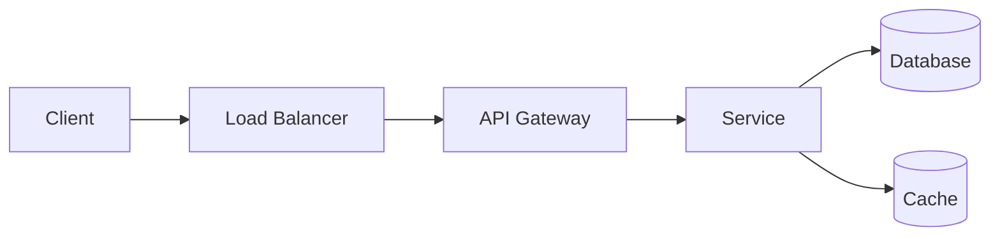

# Part N: Design a <System Name>

> Brief one-paragraph summary of what the system does and why the case is interesting.

## Problem Statement

Describe the system to design. What is the core user-facing or business problem?

## Clarifying Questions & Answers

> **Candidate:** ...
> 
> **Interviewer:** ...

Capture the scope, scale, and functional boundaries agreed upon in the interview.

## Assumptions

- List explicit assumptions about scale, user behavior, data size, etc.

## Constraints

- Latency, availability, durability, consistency, cost, or regulatory constraints.

## Functional Requirements

- List the features the system must support.

## Non-Functional Requirements

- Scalability, performance, availability, consistency, security, operability.

## Back-of-the-Envelope Estimations

| Metric | Value |
|:---|:---|
| DAU | |
| Requests/sec (peak) | |
| Storage (5-year) | |
| Cache size | |
| Bandwidth | |

## High-Level Architecture

Describe the components and how they interact. Include a Mermaid diagram if helpful.



### Key Flows

#### Write Path

1. ...
2. ...

#### Read Path

1. ...
2. ...

## API Design

### `POST /api/v1/...`

**Request:**

```json
{
  "field": "value"
}
```

**Response:** `201 Created`

```json
{
  "id": "..."
}
```

## Data Model

### Primary Store

| Field | Type | Description |
|:---|:---|:---|
| id | string | Primary key |
| ... | ... | ... |

### Cache

- Key: `...`
- Value: `...`
- TTL: `...`

## Tech Stack Options

| Component | Options | Recommendation |
|:---|:---|:---|
| API Layer | Go / Java / Node.js | ... |
| Database | PostgreSQL / Cassandra / DynamoDB | ... |
| Cache | Redis / Memcached | ... |
| Queue | Kafka / RabbitMQ | ... |
| CDN | CloudFront / Cloudflare | ... |

## Consistency vs. Availability Trade-offs

- Which operations must be CP?
- Which operations can be AP?
- How do you handle partition tolerance?

## Failure Modes & Mitigations

| Failure | Impact | Mitigation |
|:---|:---|:---|
| Database primary down | | Failover to replica |
| Cache cold start | | Circuit breaker + fallback |
| Dependency timeout | | Retry with jitter |

## Security

- Authentication, authorization, input validation, rate limiting, encryption.

## Monitoring & Observability

### Golden Signals

- Latency, traffic, errors, saturation.

### Business Metrics

- Requests per minute, success rate, etc.

### Alerts

- p99 latency > threshold.
- Error rate > threshold.

## Deployment / CI-CD

- Multi-region strategy, canary deployments, infrastructure as code.

## Cost / Operational Trade-offs

| Option | Pros | Cons |
|:---|:---|:---|
| Managed service | Less ops | Higher cost |
| Self-hosted | More control | More ops |

## Testing Strategies

- Unit, integration, load, chaos, soak, security tests.

## Alternative Approaches

1. **Option A** — trade-offs.
2. **Option B** — trade-offs.

## References

<!-- Replace the placeholders below with real links when you write the case. -->

- Related Article: `../../articles/medium/<article-file>.md`
- Related Key Takeaways: `../../system-design-architecture/<takeaways-file>.md`
- Official Documentation: `https://<vendor-docs>/...`
