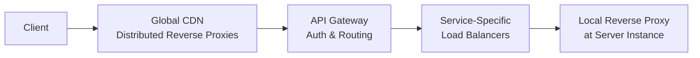

# Reverse Proxy vs Load Balancer vs API Gateway: The Real Difference?

> **Source**: [YouTube Video](https://youtube.com/watch?v=-R5ak7-LiVY)  
> **Category**: Architecture Patterns — Networking & API Management

## Overview

This video breaks down the architectural differences, use cases, and overlapping capabilities of Reverse Proxies, Load Balancers, and API Gateways, demonstrating how they serve as complementary layers in distributed systems.

> **Taxonomy Reference**: §3.3 Event-Driven & Messaging (API Gateway patterns), §5.2 Cloud Networking (Load Balancing)

---

## 1. Reverse Proxy — The Protective Layer

### What It Does

Works on behalf of the server, sitting between users and the backend infrastructure. `[03:50]`

### Core Responsibilities

| Responsibility | Description |
|---------------|-------------|
| **SSL Termination** | Handles expensive cryptographic work at the edge so the backend receives plain HTTP internally. `[04:11]` |
| **Caching & Compression** | Caches identical responses to save backend CPU cycles and compresses data (using gzip/Brotli) to reduce bandwidth. `[04:47]` `[05:10]` |
| **Security** | Hides backend servers' real IP addresses and filters malicious traffic (e.g., rate limiting, header enforcement). `[05:29]` |

### Limitations

General-purpose and acts purely at the network routing level — it does not understand business logic, user authentication, or API versions. `[06:04]`

### Common Examples

Nginx, HAProxy, Caddy. `[05:46]`

---

## 2. Load Balancer — The Traffic Distributor

### What It Does

A specialized reverse proxy that has evolved the intelligent skill of distributing traffic across a pool of multiple backend servers. `[08:01]`

### Key Routing Strategies

| Strategy | Description |
|----------|-------------|
| **Round Robin** | Cycles requests sequentially across the server pool. `[08:31]` |
| **Least Connections** | Routes to the least busy machine. `[09:00]` |
| **Weighted Routing** | Sends more traffic to more powerful hardware. `[09:24]` |

### Layer 4 vs. Layer 7

| Layer | Description |
|-------|-------------|
| **Layer 4 (Transport)** | Operates at TCP/IP level — incredibly fast but completely blind to HTTP data. `[10:01]` |
| **Layer 7 (Application)** | Understands HTTP headers, cookies, and URL paths, enabling content-based routing. `[10:27]` |

### Health Checks

Continuously pings servers; if an instance crashes, it automatically reroutes traffic without manual intervention. `[11:15]`

---

## 3. API Gateway — The Microservices Coordinator

### What It Does

Positioned at a higher level of abstraction, it is an entry point that understands your APIs, public vs. private endpoints, and subscription tiers. `[15:05]`

### Core Responsibilities

| Responsibility | Description |
|---------------|-------------|
| **Centralized Infrastructure** | Handles global tasks like token validation/authentication, logging, and rate-limiting at the edge. Prevents duplicating this code across dozens of microservices. `[14:50]` `[15:28]` `[15:53]` |
| **Request Transformation** | Translates legacy data types (e.g., XML → JSON) or manages smooth migrations from API v1 to v2. `[16:20]` `[16:36]` |
| **Visibility** | Offers a single entry point to observe latency spikes, errors, and traffic patterns. `[17:09]` |

### Common Tools

Kong, AWS API Gateway, Apigee. `[17:27]`

---

## Comparison at a Glance

| Feature | Reverse Proxy | Load Balancer | API Gateway |
|---------|:------------:|:------------:|:-----------:|
| **Primary Role** | Server protection | Traffic distribution | API coordination |
| **SSL Termination** | ✅ | ✅ | ✅ |
| **Caching** | ✅ | ❌ | ✅ |
| **Health Checks** | ❌ | ✅ | ✅ |
| **Auth / Token Validation** | ❌ | ❌ | ✅ |
| **Request Transformation** | ❌ | ❌ | ✅ |
| **Rate Limiting** | Basic | ❌ | Advanced |
| **API Versioning** | ❌ | ❌ | ✅ |

---

## Why People Confuse Them & How to Choose

### Blurred Lines

Modern software often wears "multiple hats." For example, **Nginx** can be configured as:

1. A basic **Reverse Proxy**
2. Add an `upstream` block → becomes a **Load Balancer**
3. Use OpenResty plugins → functions as an **API Gateway**

`[18:20]`

### Production Layering

In large platforms, these components are **layered together** rather than swapped out. `[21:24]`

A typical request flow: CDN (reverse proxies) → API Gateway (auth) → Load Balancers (distribution) → Local Proxies (per-instance). `[21:38]`

---

## Related Azure Services

| Component | Azure Service |
|-----------|--------------|
| Reverse Proxy / CDN | [Azure Front Door](https://learn.microsoft.com/en-us/azure/frontdoor/) |
| Load Balancer | [Azure Load Balancer](https://learn.microsoft.com/en-us/azure/load-balancer/), [Application Gateway](https://learn.microsoft.com/en-us/azure/application-gateway/) |
| API Gateway | [Azure API Management](https://learn.microsoft.com/en-us/azure/api-management/) |

> **Azure Implementation**: See [Azure Load Balancer](../architecture-azure/networking/) and [API Management](../architecture-azure/integration/) for service-specific deep-dives.

---

## Source

[Reverse Proxy vs Load Balancer vs API Gateway: The Real Difference?](https://youtube.com/watch?v=-R5ak7-LiVY)
